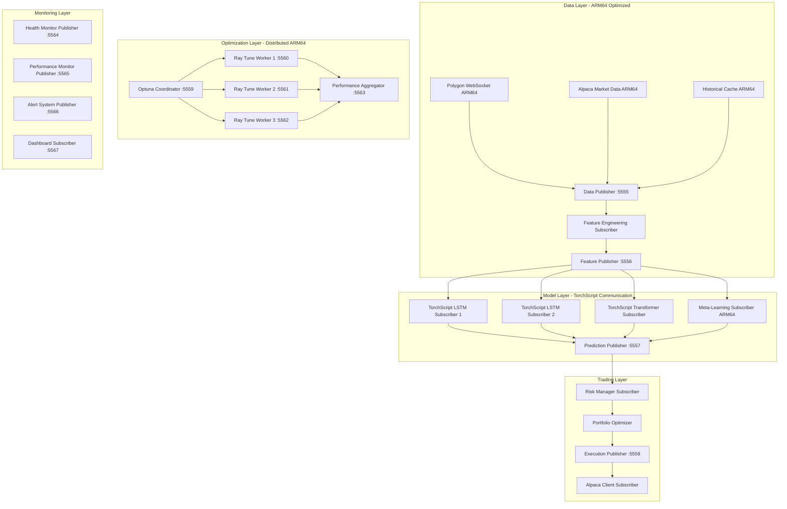
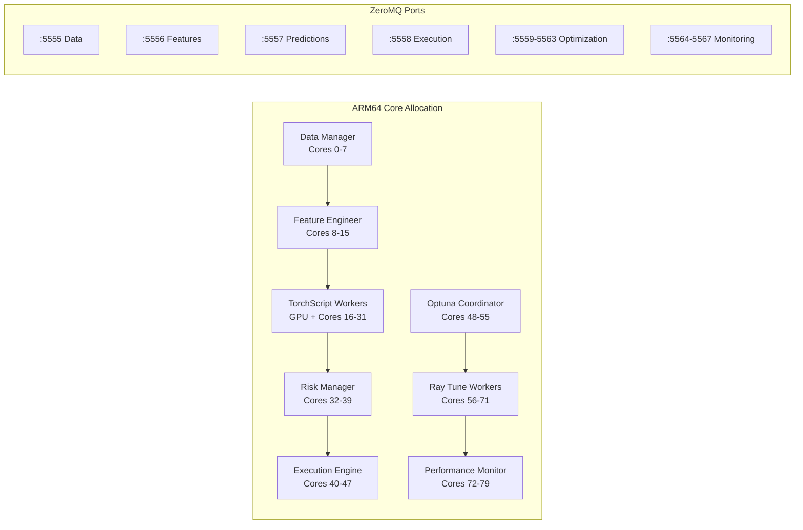

# Communication Architecture - ARM64 Optimized ZeroMQ

## Overview

The Deep Momentum Networks trading system uses a high-performance ZeroMQ-based communication architecture optimized for the NVIDIA GH200 ARM64 platform. The system coordinates real-time data flow between PyTorch TorchScript models, ARM64-optimized processes, and external APIs through a distributed messaging framework designed for sub-millisecond latency.

## Core Design Principles

### 1. ARM64-Optimized ZeroMQ Performance
- **Native ARM64 Compilation**: ZeroMQ compiled with ARM64 optimizations
- **Zero-Copy Messaging**: Direct memory access using GH200 unified memory
- **NUMA-Aware Topology**: Process placement optimized for ARM64 architecture
- **High-Frequency Trading Latency**: Sub-100μs message delivery

### 2. TorchScript Model Communication
- **Tensor Serialization**: Efficient PyTorch tensor transfer between processes
- **CUDA Graph Coordination**: Synchronized CUDA graph execution across workers
- **Mixed Precision Support**: FP16/FP32 tensor communication optimization
- **Memory Pool Sharing**: Shared tensor pools across ARM64 processes

### 3. Distributed Hyperparameter Optimization
- **Optuna Coordination**: ARM64-compatible distributed optimization
- **Ray Tune Integration**: Multi-GPU hyperparameter search coordination
- **Result Aggregation**: Efficient collection of optimization results
- **Population-Based Training**: Dynamic parameter updates across workers

## Communication Topology

### ARM64 ZeroMQ Network Architecture



### ARM64 Process Communication Matrix



## Message Protocols

### 1. ARM64-Optimized Market Data Protocol

#### Data Publisher (Port 5555)
```python
# src/communication/arm64_data_publisher.py
import zmq
import torch
import numpy as np
from typing import Dict, List
import msgpack
import lz4.frame

class ARM64DataPublisher:
    """ARM64-optimized ZeroMQ data publisher with tensor serialization"""
    
    def __init__(self, port: int = 5555):
        self.context = zmq.Context()
        self.socket = self.context.socket(zmq.PUB)
        
        # ARM64-specific socket optimizations
        self.socket.setsockopt(zmq.SNDHWM, 10000)  # High water mark
        self.socket.setsockopt(zmq.SNDBUF, 1024 * 1024)  # 1MB send buffer
        self.socket.setsockopt(zmq.TCP_KEEPALIVE, 1)
        self.socket.setsockopt(zmq.TCP_KEEPALIVE_IDLE, 60)
        
        self.socket.bind(f"tcp://*:{port}")
        
        # ARM64 memory optimization
        self.tensor_pool = {}
        self.compression_enabled = True
        
    def publish_market_data(self, symbol: str, data: Dict):
        """Publish market data with ARM64 tensor optimization"""
        
        # Convert to ARM64-optimized tensors
        price_tensor = torch.tensor(
            data['prices'], 
            dtype=torch.float16, 
            device='cuda'
        )
        volume_tensor = torch.tensor(
            data['volumes'], 
            dtype=torch.float16, 
            device='cuda'
        )
        
        # Serialize message with compression
        message = {
            'symbol': symbol,
            'timestamp': data['timestamp'],
            'prices': self._serialize_tensor(price_tensor),
            'volumes': self._serialize_tensor(volume_tensor),
            'metadata': data.get('metadata', {})
        }
        
        # Pack and compress
        packed_data = msgpack.packb(message)
        if self.compression_enabled and len(packed_data) > 1024:
            packed_data = lz4.frame.compress(packed_data)
            topic = f"market_data_compressed.{symbol}"
        else:
            topic = f"market_data.{symbol}"
        
        # Send with topic routing
        self.socket.send_multipart([
            topic.encode('utf-8'),
            packed_data
        ])
    
    def _serialize_tensor(self, tensor: torch.Tensor) -> bytes:
        """Efficient tensor serialization for ARM64"""
        
        # Move to CPU if on GPU for serialization
        if tensor.is_cuda:
            cpu_tensor = tensor.cpu()
        else:
            cpu_tensor = tensor
        
        # Convert to numpy and serialize
        numpy_array = cpu_tensor.numpy()
        return msgpack.packb({
            'data': numpy_array.tobytes(),
            'shape': numpy_array.shape,
            'dtype': str(numpy_array.dtype)
        })
    
    def publish_feature_update(self, symbol: str, features: torch.Tensor, 
                             confidence: float):
        """Publish TorchScript-compatible feature updates"""
        
        message = {
            'symbol': symbol,
            'timestamp': time.time(),
            'features': self._serialize_tensor(features),
            'confidence': confidence,
            'model_version': 'torchscript_v1.0'
        }
        
        packed_data = msgpack.packb(message)
        topic = f"features.{symbol}"
        
        self.socket.send_multipart([
            topic.encode('utf-8'),
            packed_data
        ])
```

#### TorchScript Model Subscriber
```python
# src/communication/torchscript_subscriber.py
class TorchScriptModelSubscriber:
    """ARM64-optimized subscriber for TorchScript model workers"""
    
    def __init__(self, publisher_port: int = 5556, model_id: str = "lstm_1"):
        self.context = zmq.Context()
        self.socket = self.context.socket(zmq.SUB)
        
        # ARM64 socket optimizations
        self.socket.setsockopt(zmq.RCVHWM, 10000)
        self.socket.setsockopt(zmq.RCVBUF, 1024 * 1024)
        self.socket.setsockopt(zmq.SUBSCRIBE, b"features.")
        
        self.socket.connect(f"tcp://localhost:{publisher_port}")
        
        self.model_id = model_id
        self.tensor_cache = {}
        self.cuda_stream = torch.cuda.Stream()
        
    def receive_features(self) -> Dict:
        """Receive and deserialize features for TorchScript processing"""
        
        try:
            # Non-blocking receive
            topic, data = self.socket.recv_multipart(zmq.NOBLOCK)
            
            # Decompress if needed
            if b"compressed" in topic:
                data = lz4.frame.decompress(data)
            
            # Unpack message
            message = msgpack.unpackb(data, raw=False)
            
            # Deserialize tensor with CUDA stream
            with torch.cuda.stream(self.cuda_stream):
                features = self._deserialize_tensor(message['features'])
                
                # Move to GPU asynchronously
                if not features.is_cuda:
                    features = features.cuda(non_blocking=True)
            
            return {
                'symbol': message['symbol'],
                'timestamp': message['timestamp'],
                'features': features,
                'confidence': message['confidence'],
                'model_version': message.get('model_version', 'unknown')
            }
            
        except zmq.Again:
            return None
    
    def _deserialize_tensor(self, tensor_data: Dict) -> torch.Tensor:
        """Efficient tensor deserialization for ARM64"""
        
        # Reconstruct numpy array
        numpy_array = np.frombuffer(
            tensor_data['data'], 
            dtype=tensor_data['dtype']
        ).reshape(tensor_data['shape'])
        
        # Convert to PyTorch tensor
        return torch.from_numpy(numpy_array)
```

### 2. Hyperparameter Optimization Communication

#### Optuna Coordinator
```python
# src/communication/optuna_coordinator.py
class OptunaCoordinator:
    """ARM64-optimized Optuna coordination with Ray Tune"""
    
    def __init__(self, coordinator_port: int = 5559):
        self.context = zmq.Context()
        
        # Publisher for distributing trials
        self.trial_publisher = self.context.socket(zmq.PUB)
        self.trial_publisher.bind(f"tcp://*:{coordinator_port}")
        
        # Subscriber for collecting results
        self.result_subscriber = self.context.socket(zmq.SUB)
        self.result_subscriber.setsockopt(zmq.SUBSCRIBE, b"optimization_result")
        
        # Connect to worker result ports
        for worker_port in range(5560, 5563):
            self.result_subscriber.connect(f"tcp://localhost:{worker_port}")
        
        self.active_trials = {}
        self.completed_trials = []
        
    def distribute_trial(self, trial_config: Dict):
        """Distribute hyperparameter trial to ARM64 workers"""
        
        trial_message = {
            'trial_id': trial_config['trial_id'],
            'config': trial_config['config'],
            'timestamp': time.time(),
            'target_worker': trial_config.get('target_worker', 'any'),
            'optimization_objectives': [
                'sharpe_ratio', 'calmar_ratio', 'max_drawdown',
                'inference_latency', 'throughput'
            ]
        }
        
        packed_data = msgpack.packb(trial_message)
        topic = f"optimization_trial.{trial_config['trial_id']}"
        
        self.trial_publisher.send_multipart([
            topic.encode('utf-8'),
            packed_data
        ])
        
        self.active_trials[trial_config['trial_id']] = trial_message
    
    def collect_results(self) -> List[Dict]:
        """Collect optimization results from ARM64 workers"""
        
        results = []
        
        while True:
            try:
                topic, data = self.result_subscriber.recv_multipart(zmq.NOBLOCK)
                message = msgpack.unpackb(data, raw=False)
                
                trial_id = message['trial_id']
                if trial_id in self.active_trials:
                    # Process completed trial
                    result = {
                        'trial_id': trial_id,
                        'config': self.active_trials[trial_id]['config'],
                        'metrics': message['metrics'],
                        'performance_stats': message['performance_stats'],
                        'completion_time': message['timestamp'],
                        'worker_id': message['worker_id']
                    }
                    
                    results.append(result)
                    self.completed_trials.append(result)
                    del self.active_trials[trial_id]
                
            except zmq.Again:
                break
        
        return results
```

#### Ray Tune Worker Communication
```python
# src/communication/ray_tune_worker.py
class RayTuneWorker:
    """ARM64-optimized Ray Tune worker with ZeroMQ communication"""
    
    def __init__(self, worker_id: int, result_port: int):
        self.worker_id = worker_id
        self.context = zmq.Context()
        
        # Subscribe to trial distribution
        self.trial_subscriber = self.context.socket(zmq.SUB)
        self.trial_subscriber.setsockopt(zmq.SUBSCRIBE, b"optimization_trial")
        self.trial_subscriber.connect("tcp://localhost:5559")
        
        # Publisher for results
        self.result_publisher = self.context.socket(zmq.PUB)
        self.result_publisher.bind(f"tcp://*:{result_port}")
        
        # ARM64 performance monitoring
        self.performance_monitor = ARM64PerformanceMonitor()
        
    def process_trial(self, trial_config: Dict) -> Dict:
        """Process hyperparameter trial on ARM64"""
        
        start_time = time.perf_counter()
        
        # Track ARM64 performance during trial
        performance_stats = self.performance_monitor.start_trial_monitoring()
        
        try:
            # Execute trial with ARM64 optimizations
            model_metrics = self.train_model_arm64(trial_config['config'])
            trading_metrics = self.evaluate_trading_performance(model_metrics)
            inference_metrics = self.benchmark_arm64_inference(trial_config['config'])
            
            # Calculate multi-objective metrics
            metrics = {
                'sharpe_ratio': trading_metrics['sharpe_ratio'],
                'calmar_ratio': trading_metrics['calmar_ratio'],
                'sortino_ratio': trading_metrics['sortino_ratio'],
                'max_drawdown': trading_metrics['max_drawdown'],
                'var_95': trading_metrics['var_95'],
                'inference_latency_ms': inference_metrics['latency_ms'],
                'throughput_per_sec': inference_metrics['throughput_per_sec'],
                'memory_efficiency': inference_metrics['memory_efficiency'],
                'arm64_cpu_utilization': performance_stats['cpu_utilization'],
                'cuda_graph_speedup': inference_metrics['cuda_graph_speedup']
            }
            
            completion_time = time.perf_counter() - start_time
            
            return {
                'trial_id': trial_config['trial_id'],
                'metrics': metrics,
                'performance_stats': performance_stats,
                'completion_time': completion_time,
                'worker_id': self.worker_id,
                'timestamp': time.time(),
                'status': 'completed'
            }
            
        except Exception as e:
            return {
                'trial_id': trial_config['trial_id'],
                'error': str(e),
                'worker_id': self.worker_id,
                'timestamp': time.time(),
                'status': 'failed'
            }
        
        finally:
            self.performance_monitor.stop_trial_monitoring()
    
    def send_result(self, result: Dict):
        """Send trial result back to coordinator"""
        
        packed_data = msgpack.packb(result)
        topic = f"optimization_result.{result['trial_id']}"
        
        self.result_publisher.send_multipart([
            topic.encode('utf-8'),
            packed_data
        ])
```

## Performance Optimizations

### ARM64 ZeroMQ Configuration

```python
# src/communication/arm64_zmq_config.py
class ARM64ZMQConfig:
    """ARM64-specific ZeroMQ optimizations"""
    
    @staticmethod
    def configure_socket_for_arm64(socket: zmq.Socket, socket_type: str):
        """Apply ARM64-specific socket optimizations"""
        
        if socket_type == "publisher":
            # Publisher optimizations
            socket.setsockopt(zmq.SNDHWM, 50000)  # High water mark
            socket.setsockopt(zmq.SNDBUF, 4 * 1024 * 1024)  # 4MB buffer
            socket.setsockopt(zmq.RATE, 1000000)  # 1Mbps rate limit
            socket.setsockopt(zmq.RECOVERY_IVL, 1000)  # 1s recovery
            
        elif socket_type == "subscriber":
            # Subscriber optimizations
            socket.setsockopt(zmq.RCVHWM, 50000)
            socket.setsockopt(zmq.RCVBUF, 4 * 1024 * 1024)
            socket.setsockopt(zmq.RECONNECT_IVL, 100)  # 100ms reconnect
            socket.setsockopt(zmq.RECONNECT_IVL_MAX, 1000)  # 1s max
            
        elif socket_type == "request":
            # Request-reply optimizations
            socket.setsockopt(zmq.REQ_CORRELATE, 1)
            socket.setsockopt(zmq.REQ_RELAXED, 1)
            socket.setsockopt(zmq.RCVTIMEO, 5000)  # 5s timeout
            socket.setsockopt(zmq.SNDTIMEO, 5000)
        
        # Common ARM64 optimizations
        socket.setsockopt(zmq.TCP_KEEPALIVE, 1)
        socket.setsockopt(zmq.TCP_KEEPALIVE_IDLE, 60)
        socket.setsockopt(zmq.TCP_KEEPALIVE_CNT, 3)
        socket.setsockopt(zmq.TCP_KEEPALIVE_INTVL, 10)
        
        # ARM64 specific TCP optimizations
        socket.setsockopt(zmq.IMMEDIATE, 1)  # Disable Nagle's algorithm
        socket.setsockopt(zmq.IPV6, 0)  # Disable IPv6 for performance
```

### Message Compression and Serialization

```python
# src/communication/arm64_serialization.py
class ARM64MessageSerializer:
    """ARM64-optimized message serialization with compression"""
    
    def __init__(self):
        self.compression_threshold = 1024  # Compress messages > 1KB
        self.tensor_cache = {}
        
    def serialize_message(self, message: Dict, compress: bool = True) -> bytes:
        """Serialize message with ARM64 optimizations"""
        
        # Handle PyTorch tensors specially
        processed_message = self._process_tensors(message)
        
        # Use msgpack for efficient serialization
        packed_data = msgpack.packb(processed_message, use_bin_type=True)
        
        # Compress large messages
        if compress and len(packed_data) > self.compression_threshold:
            return lz4.frame.compress(
                packed_data,
                compression_level=lz4.frame.COMPRESSIONLEVEL_MINHC
            )
        
        return packed_data
    
    def deserialize_message(self, data: bytes, compressed: bool = False) -> Dict:
        """Deserialize message with ARM64 optimizations"""
        
        # Decompress if needed
        if compressed:
            data = lz4.frame.decompress(data)
        
        # Unpack message
        message = msgpack.unpackb(data, raw=False)
        
        # Reconstruct tensors
        return self._reconstruct_tensors(message)
    
    def _process_tensors(self, obj):
        """Process PyTorch tensors for serialization"""
        
        if isinstance(obj, torch.Tensor):
            # Convert to CPU and numpy for serialization
            if obj.is_cuda:
                cpu_tensor = obj.cpu()
            else:
                cpu_tensor = obj
            
            numpy_array = cpu_tensor.numpy()
            return {
                '__tensor__': True,
                'data': numpy_array.tobytes(),
                'shape': numpy_array.shape,
                'dtype': str(numpy_array.dtype),
                'device': 'cuda' if obj.is_cuda else 'cpu'
            }
        
        elif isinstance(obj, dict):
            return {k: self._process_tensors(v) for k, v in obj.items()}
        
        elif isinstance(obj, list):
            return [self._process_tensors(item) for item in obj]
        
        return obj
    
    def _reconstruct_tensors(self, obj):
        """Reconstruct PyTorch tensors from serialized data"""
        
        if isinstance(obj, dict) and obj.get('__tensor__'):
            # Reconstruct tensor
            numpy_array = np.frombuffer(
                obj['data'], 
                dtype=obj['dtype']
            ).reshape(obj['shape'])
            
            tensor = torch.from_numpy(numpy_array)
            
            # Move to original device
            if obj['device'] == 'cuda' and torch.cuda.is_available():
                tensor = tensor.cuda()
            
            return tensor
        
        elif isinstance(obj, dict):
            return {k: self._reconstruct_tensors(v) for k, v in obj.items()}
        
        elif isinstance(obj, list):
            return [self._reconstruct_tensors(item) for item in obj]
        
        return obj
```

## Latency Optimization

### ARM64 Communication Latency Targets

| Communication Path | Target Latency | Maximum Latency | Optimization |
|-------------------|----------------|-----------------|--------------|
| **Data Publisher → Feature Subscriber** | < 50μs | < 200μs | ARM64 zero-copy |
| **Feature Publisher → Model Subscriber** | < 100μs | < 500μs | Tensor serialization |
| **Model → Risk Manager** | < 200μs | < 1ms | CUDA graph sync |
| **Risk → Execution** | < 100μs | < 500μs | ARM64 processing |
| **Optuna Coordination** | < 1ms | < 5ms | Distributed optimization |
| **Performance Monitoring** | < 500μs | < 2ms | ARM64 metrics |

### Message Size Optimization

| Message Type | Typical Size | Maximum Size | Compression Ratio |
|--------------|--------------|--------------|-------------------|
| **Market Data** | 2-8 KB | 50 KB | 3:1 with LZ4 |
| **Feature Vectors** | 5-20 KB | 100 KB | 2:1 with msgpack |
| **Model Predictions** | 1-5 KB | 20 KB | 4:1 with compression |
| **Risk Metrics** | 500B-2KB | 10 KB | 2:1 optimization |
| **Optimization Results** | 10-50 KB | 500 KB | 5:1 with LZ4 |

## Error Handling and Resilience

### ARM64 Connection Management
```python
# src/communication/arm64_connection_manager.py
class ARM64ConnectionManager:
    """ARM64-optimized connection management with automatic recovery"""
    
    def __init__(self):
        self.connections = {}
        self.health_checks = {}
        self.reconnect_strategies = {}
        
    def setup_resilient_connection(self, endpoint: str, socket_type: str):
        """Setup resilient ZeroMQ connection with ARM64 optimizations"""
        
        context = zmq.Context()
        socket = context.socket(getattr(zmq, socket_type.upper()))
        
        # Apply ARM64 optimizations
        ARM64ZMQConfig.configure_socket_for_arm64(socket, socket_type)
        
        # Setup connection monitoring
        self.health_checks[endpoint] = {
            'last_heartbeat': time.time(),
            'failure_count': 0,
            'status': 'connected'
        }
        
        # Configure reconnection strategy
        self.reconnect_strategies[endpoint] = {
            'max_retries': 10,
            'backoff_factor': 1.5,
            'initial_delay': 0.1
        }
        
        return socket
    
    def monitor_connection_health(self):
        """Monitor ARM64 connection health and trigger recovery"""
        
        for endpoint, health in self.health_checks.items():
            if time.time() - health['last_heartbeat'] > 30:  # 30s timeout
                logger.warning(f"Connection {endpoint} appears unhealthy")
                self.trigger_reconnection(endpoint)
    
    def trigger_reconnection(self, endpoint: str):
        """Trigger ARM64-optimized reconnection"""
        
        strategy = self.reconnect_strategies[endpoint]
        health = self.health_checks[endpoint]
        
        if health['failure_count'] < strategy['max_retries']:
            delay = strategy['initial_delay'] * (
                strategy['backoff_factor'] ** health['failure_count']
            )
            
            logger.info(f"Reconnecting to {endpoint} in {delay:.2f}s")
            time.sleep(delay)
            
            # Attempt reconnection
            success = self.attempt_reconnection(endpoint)
            
            if success:
                health['failure_count'] = 0
                health['status'] = 'connected'
                health['last_heartbeat'] = time.time()
            else:
                health['failure_count'] += 1
                health['status'] = 'reconnecting'
```

## Monitoring and Debugging

### ARM64 Communication Metrics
```python
# src/communication/arm64_comm_monitor.py
class ARM64CommunicationMonitor:
    """Monitor ARM64 communication performance and health"""
    
    def __init__(self):
        self.metrics = {
            'message_latency': deque(maxlen=10000),
            'throughput': deque(maxlen=1000),
            'error_rate': deque(maxlen=1000),
            'compression_ratio': deque(maxlen=1000),
            'arm64_cpu_usage': deque(maxlen=1000)
        }
        
    def track_message_latency(self, start_time: float, end_time: float):
        """Track message latency for ARM64 optimization"""
        latency_ms = (end_time - start_time) * 1000
        self.metrics['message_latency'].append(latency_ms)
        
    def get_communication_stats(self) -> Dict:
        """Get comprehensive ARM64 communication statistics"""
        
        if not self.metrics['message_latency']:
            return {}
        
        latencies = list(self.metrics['message_latency'])
        
        return {
            'avg_latency_ms': np.mean(latencies),
            'p95_latency_ms': np.percentile(latencies, 95),
            'p99_latency_ms': np.percentile(latencies, 99),
            'max_latency_ms': np.max(latencies),
            'throughput_msg_per_sec': len(latencies) / 60,  # Last minute
            'arm64_optimization_factor': self.calculate_arm64_speedup(),
            'memory_efficiency': self.calculate_memory_efficiency()
        }
```

This ARM64-optimized communication architecture provides the high-performance, low-latency messaging infrastructure needed for real-time trading while supporting distributed hyperparameter optimization and TorchScript model coordination on the GH200 platform.