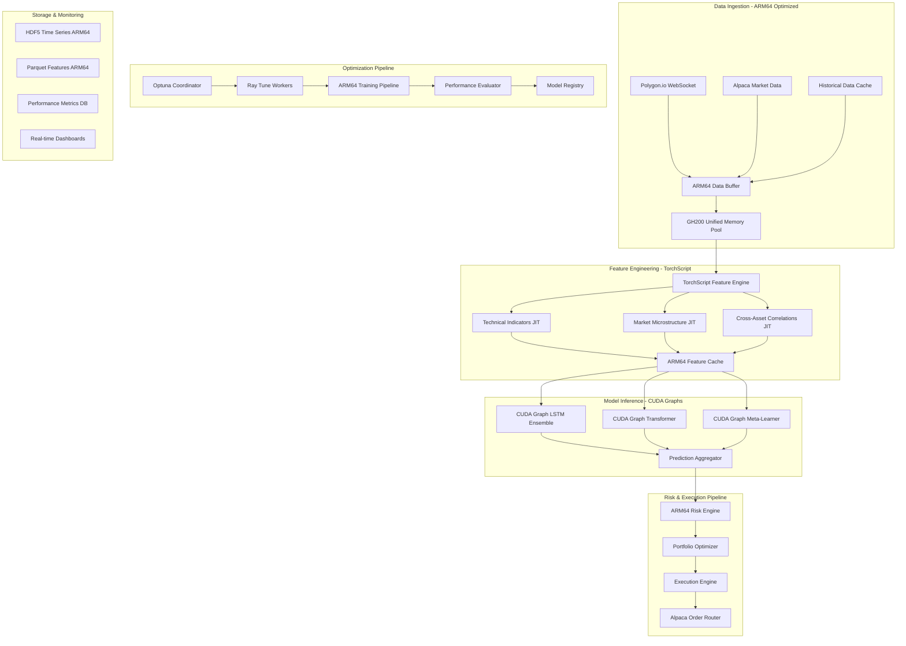
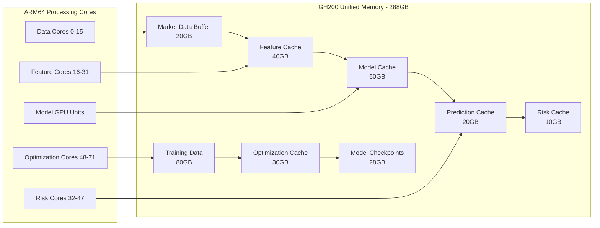

# Data Flow Architecture - ARM64 Optimized Pipeline

## Overview

The Deep Momentum Networks trading system implements a high-throughput, low-latency data processing pipeline optimized for the NVIDIA GH200 ARM64 platform. The system processes real-time market data through TorchScript-optimized feature engineering, CUDA graph-accelerated model inference, and ARM64-native risk management, all coordinated through GH200 unified memory architecture.

## Core Design Principles

### 1. GH200 Unified Memory Data Flow
- **Zero-Copy Operations**: Direct tensor sharing between CPU and GPU processes
- **288GB Memory Pool**: Massive in-memory data processing without I/O bottlenecks
- **ARM64 Memory Bandwidth**: 900GB/s memory throughput optimization
- **Streaming Architecture**: Continuous data flow without buffering delays

### 2. TorchScript Feature Pipeline
- **JIT Compilation**: Real-time feature engineering with ARM64 optimization
- **Mixed Precision**: FP16/FP32 processing for 2x speed improvement
- **Vectorized Operations**: SIMD instructions for ARM64 acceleration
- **Memory-Mapped Features**: Direct access to feature tensors

### 3. CUDA Graph Model Pipeline
- **Graph Capture**: Pre-compiled inference graphs for ultra-low latency
- **Batch Processing**: Dynamic batching for throughput optimization
- **Multi-Model Ensemble**: Parallel execution across GPU compute units
- **Asynchronous Execution**: Non-blocking inference with CUDA streams

### 4. Distributed Hyperparameter Flow
- **Optuna Integration**: ARM64-compatible Bayesian optimization
- **Ray Tune Coordination**: Multi-GPU distributed search
- **Population-Based Training**: Dynamic parameter updates during training
- **Result Aggregation**: Efficient collection and analysis of optimization results

## Data Flow Architecture

### High-Level Data Pipeline



### ARM64 Memory Flow Diagram



## Data Processing Stages

### 1. ARM64-Optimized Data Ingestion

#### Real-Time Market Data Processing
```python
# src/data/arm64_data_ingestion.py
import torch
import numpy as np
from typing import Dict, List, Optional
import asyncio
import websockets
import json

class ARM64DataIngestionEngine:
    """ARM64-optimized real-time data ingestion with GH200 memory management"""
    
    def __init__(self, memory_pool_size_gb: float = 20.0):
        self.device = torch.device('cuda' if torch.cuda.is_available() else 'cpu')
        
        # GH200 unified memory pool for market data
        self.memory_pool_size = int(memory_pool_size_gb * 1024**3)
        self.data_buffers = self._initialize_memory_pools()
        
        # ARM64-optimized data structures
        self.symbol_indices = {}
        self.current_buffer_index = 0
        self.buffer_rotation_size = 1000000  # 1M data points per buffer
        
        # Performance tracking
        self.ingestion_stats = {
            'messages_per_second': 0,
            'bytes_per_second': 0,
            'arm64_cpu_utilization': 0,
            'memory_utilization': 0
        }
    
    def _initialize_memory_pools(self) -> Dict[str, torch.Tensor]:
        """Initialize GH200 unified memory pools for different data types"""
        
        pools = {
            # Price data: [timestamp, open, high, low, close, volume]
            'price_data': torch.zeros(
                (self.buffer_rotation_size, 6), 
                dtype=torch.float32, 
                device=self.device
            ),
            
            # Order book data: [bid_prices, ask_prices, bid_sizes, ask_sizes] (10 levels)
            'orderbook_data': torch.zeros(
                (self.buffer_rotation_size, 40), 
                dtype=torch.float32, 
                device=self.device
            ),
            
            # Trade data: [timestamp, price, size, side]
            'trade_data': torch.zeros(
                (self.buffer_rotation_size, 4), 
                dtype=torch.float32, 
                device=self.device
            ),
            
            # Symbol metadata: [symbol_id, market_cap, sector, volatility]
            'symbol_metadata': torch.zeros(
                (5000, 4), 
                dtype=torch.float32, 
                device=self.device
            )
        }
        
        return pools
    
    async def process_polygon_stream(self, websocket_url: str, api_key: str):
        """Process Polygon.io WebSocket stream with ARM64 optimization"""
        
        headers = {"Authorization": f"Bearer {api_key}"}
        
        async with websockets.connect(websocket_url, extra_headers=headers) as websocket:
            # Subscribe to all required data types
            subscription = {
                "action": "subscribe",
                "params": "T.*,Q.*,A.*"  # Trades, Quotes, Aggregates
            }
            await websocket.send(json.dumps(subscription))
            
            batch_buffer = []
            batch_size = 1000  # Process in batches for ARM64 efficiency
            
            async for message in websocket:
                try:
                    data = json.loads(message)
                    batch_buffer.append(data)
                    
                    if len(batch_buffer) >= batch_size:
                        # Process batch with ARM64 optimization
                        await self._process_data_batch(batch_buffer)
                        batch_buffer.clear()
                        
                except Exception as e:
                    logger.error(f"ARM64 data processing error: {e}")
    
    async def _process_data_batch(self, batch: List[Dict]):
        """Process data batch with ARM64 vectorization"""
        
        # Separate data by type for vectorized processing
        trades = [msg for msg in batch if msg.get('ev') == 'T']
        quotes = [msg for msg in batch if msg.get('ev') == 'Q']
        aggregates = [msg for msg in batch if msg.get('ev') == 'A']
        
        # Process each type with ARM64 SIMD operations
        if trades:
            await self._process_trades_vectorized(trades)
        if quotes:
            await self._process_quotes_vectorized(quotes)
        if aggregates:
            await self._process_aggregates_vectorized(aggregates)
    
    async def _process_trades_vectorized(self, trades: List[Dict]):
        """Vectorized trade processing with ARM64 SIMD"""
        
        if not trades:
            return
        
        # Extract data into numpy arrays for vectorization
        timestamps = np.array([trade['t'] for trade in trades], dtype=np.float64)
        prices = np.array([trade['p'] for trade in trades], dtype=np.float32)
        sizes = np.array([trade['s'] for trade in trades], dtype=np.float32)
        sides = np.array([1.0 if trade.get('side') == 'buy' else -1.0 
                         for trade in trades], dtype=np.float32)
        
        # Convert to PyTorch tensors on GPU
        trade_tensor = torch.stack([
            torch.from_numpy(timestamps).to(self.device),
            torch.from_numpy(prices).to(self.device),
            torch.from_numpy(sizes).to(self.device),
            torch.from_numpy(sides).to(self.device)
        ], dim=1)
        
        # Store in rotating buffer
        start_idx = self.current_buffer_index
        end_idx = start_idx + len(trades)
        
        if end_idx < self.buffer_rotation_size:
            self.data_buffers['trade_data'][start_idx:end_idx] = trade_tensor
            self.current_buffer_index = end_idx
        else:
            # Handle buffer rotation
            self._rotate_buffers()
            self.data_buffers['trade_data'][:len(trades)] = trade_tensor
            self.current_buffer_index = len(trades)
    
    def _rotate_buffers(self):
        """Rotate memory buffers for continuous operation"""
        
        # Archive current buffer data to storage
        self._archive_buffer_data()
        
        # Clear buffers for new data
        for buffer_name, buffer_tensor in self.data_buffers.items():
            buffer_tensor.zero_()
        
        self.current_buffer_index = 0
    
    def get_latest_data(self, symbol: str, data_type: str, 
                       lookback_periods: int = 100) -> torch.Tensor:
        """Get latest data for symbol with ARM64 optimization"""
        
        if symbol not in self.symbol_indices:
            return torch.empty(0, device=self.device)
        
        symbol_idx = self.symbol_indices[symbol]
        buffer = self.data_buffers[data_type]
        
        # Get recent data for symbol
        symbol_mask = buffer[:, 0] == symbol_idx
        symbol_data = buffer[symbol_mask]
        
        # Return most recent lookback_periods
        if len(symbol_data) > lookback_periods:
            return symbol_data[-lookback_periods:]
        else:
            return symbol_data
```

### 2. TorchScript Feature Engineering Pipeline

#### ARM64-Optimized Feature Engineering
```python
# src/data/torchscript_feature_engineering.py
import torch
import torch.jit
from typing import Tuple, Dict, Optional

@torch.jit.script
class TorchScriptFeatureEngine:
    """ARM64-optimized feature engineering with JIT compilation"""
    
    def __init__(self):
        self.device = torch.device('cuda')
        
        # Pre-computed constants for ARM64 optimization
        self.rsi_alpha = torch.tensor(1.0 / 14.0, device=self.device)
        self.macd_fast_alpha = torch.tensor(2.0 / 13.0, device=self.device)
        self.macd_slow_alpha = torch.tensor(2.0 / 27.0, device=self.device)
        self.macd_signal_alpha = torch.tensor(2.0 / 10.0, device=self.device)
        
    def compute_comprehensive_features(self, 
                                     price_data: torch.Tensor,
                                     volume_data: torch.Tensor,
                                     orderbook_data: torch.Tensor) -> torch.Tensor:
        """Compute comprehensive feature set with ARM64 optimization"""
        
        # Technical indicators
        technical_features = self.compute_technical_indicators(price_data, volume_data)
        
        # Market microstructure features
        microstructure_features = self.compute_microstructure_features(orderbook_data)
        
        # Cross-asset correlation features
        correlation_features = self.compute_correlation_features(price_data)
        
        # Volatility and risk features
        volatility_features = self.compute_volatility_features(price_data)
        
        # Combine all features
        all_features = torch.cat([
            technical_features,
            microstructure_features,
            correlation_features,
            volatility_features
        ], dim=-1)
        
        return all_features
    
    def compute_technical_indicators(self, 
                                   prices: torch.Tensor, 
                                   volumes: torch.Tensor) -> torch.Tensor:
        """Compute technical indicators with ARM64 SIMD optimization"""
        
        # RSI calculation with ARM64 optimization
        rsi = self.compute_rsi_optimized(prices)
        
        # MACD calculation
        macd_line, macd_signal, macd_histogram = self.compute_macd_optimized(prices)
        
        # Bollinger Bands
        bb_upper, bb_middle, bb_lower = self.compute_bollinger_bands(prices)
        
        # Volume-weighted features
        vwap = self.compute_vwap(prices, volumes)
        volume_profile = self.compute_volume_profile(prices, volumes)
        
        # Momentum indicators
        momentum_5 = prices / torch.roll(prices, 5, dims=-1) - 1.0
        momentum_20 = prices / torch.roll(prices, 20, dims=-1) - 1.0
        
        # Price action features
        price_range = (torch.max(prices, dim=-1, keepdim=True)[0] - 
                      torch.min(prices, dim=-1, keepdim=True)[0])
        price_position = (prices - torch.min(prices, dim=-1, keepdim=True)[0]) / price_range
        
        return torch.stack([
            rsi, macd_line, macd_signal, macd_histogram,
            bb_upper, bb_middle, bb_lower,
            vwap, volume_profile,
            momentum_5, momentum_20,
            price_position.squeeze(-1)
        ], dim=-1)
    
    def compute_rsi_optimized(self, prices: torch.Tensor, period: int = 14) -> torch.Tensor:
        """ARM64-optimized RSI calculation using unfold operations"""
        
        # Calculate price changes
        delta = torch.diff(prices, dim=-1)
        
        # Separate gains and losses
        gains = torch.clamp(delta, min=0.0)
        losses = torch.clamp(-delta, min=0.0)
        
        # Use unfold for efficient windowed operations on ARM64
        if gains.size(-1) >= period:
            gain_windows = gains.unfold(-1, period, 1)
            loss_windows = losses.unfold(-1, period, 1)
            
            # Exponential moving average using matrix operations
            weights = torch.pow(1 - self.rsi_alpha, 
                              torch.arange(period, dtype=torch.float32, device=self.device))
            weights = weights / weights.sum()
            
            avg_gains = torch.sum(gain_windows * weights, dim=-1)
            avg_losses = torch.sum(loss_windows * weights, dim=-1)
            
            # Calculate RSI
            rs = avg_gains / (avg_losses + 1e-8)
            rsi = 100.0 - (100.0 / (1.0 + rs))
            
            # Pad to match input size
            padding = torch.full((rsi.size(0), period), 50.0, device=self.device)
            return torch.cat([padding, rsi], dim=-1)
        else:
            return torch.full_like(prices, 50.0)
    
    def compute_macd_optimized(self, prices: torch.Tensor) -> Tuple[torch.Tensor, torch.Tensor, torch.Tensor]:
        """ARM64-optimized MACD calculation"""
        
        # Exponential moving averages
        ema_12 = self.exponential_moving_average(prices, self.macd_fast_alpha)
        ema_26 = self.exponential_moving_average(prices, self.macd_slow_alpha)
        
        # MACD line
        macd_line = ema_12 - ema_26
        
        # Signal line
        macd_signal = self.exponential_moving_average(macd_line, self.macd_signal_alpha)
        
        # Histogram
        macd_histogram = macd_line - macd_signal
        
        return macd_line, macd_signal, macd_histogram
    
    def exponential_moving_average(self, data: torch.Tensor, alpha: torch.Tensor) -> torch.Tensor:
        """ARM64-optimized exponential moving average"""
        
        # Initialize output tensor
        ema = torch.zeros_like(data)
        ema[..., 0] = data[..., 0]
        
        # Compute EMA iteratively (optimized for ARM64)
        for i in range(1, data.size(-1)):
            ema[..., i] = alpha * data[..., i] + (1 - alpha) * ema[..., i-1]
        
        return ema
    
    def compute_microstructure_features(self, orderbook_data: torch.Tensor) -> torch.Tensor:
        """Compute market microstructure features with ARM64 optimization"""
        
        # Extract bid/ask data (assuming 10 levels)
        bid_prices = orderbook_data[..., :10]
        ask_prices = orderbook_data[..., 10:20]
        bid_sizes = orderbook_data[..., 20:30]
        ask_sizes = orderbook_data[..., 30:40]
        
        # Bid-ask spread
        spread = ask_prices[..., 0] - bid_prices[..., 0]
        mid_price = (ask_prices[..., 0] + bid_prices[..., 0]) / 2.0
        relative_spread = spread / mid_price
        
        # Order book imbalance
        total_bid_size = torch.sum(bid_sizes, dim=-1)
        total_ask_size = torch.sum(ask_sizes, dim=-1)
        imbalance = (total_bid_size - total_ask_size) / (total_bid_size + total_ask_size + 1e-8)
        
        # Weighted mid price
        weighted_bid = torch.sum(bid_prices * bid_sizes, dim=-1) / torch.sum(bid_sizes, dim=-1)
        weighted_ask = torch.sum(ask_prices * ask_sizes, dim=-1) / torch.sum(ask_sizes, dim=-1)
        weighted_mid = (weighted_bid + weighted_ask) / 2.0
        
        # Order book depth
        depth_5_levels = torch.sum(bid_sizes[..., :5] + ask_sizes[..., :5], dim=-1)
        
        # Price impact estimation
        price_impact = torch.abs(weighted_mid - mid_price) / mid_price
        
        return torch.stack([
            spread, relative_spread, imbalance,
            weighted_mid, depth_5_levels, price_impact
        ], dim=-1)
    
    def compute_correlation_features(self, price_data: torch.Tensor) -> torch.Tensor:
        """Compute cross-asset correlation features"""
        
        # Calculate returns
        returns = torch.diff(torch.log(price_data + 1e-8), dim=-1)
        
        # Rolling correlation with market (assuming first asset is market index)
        if price_data.size(0) > 1:
            market_returns = returns[0:1, :]
            
            # Compute rolling correlations
            window_size = 20
            correlations = []
            
            for i in range(1, returns.size(0)):
                asset_returns = returns[i:i+1, :]
                
                if asset_returns.size(-1) >= window_size:
                    # Use unfold for efficient windowed correlation
                    market_windows = market_returns.unfold(-1, window_size, 1)
                    asset_windows = asset_returns.unfold(-1, window_size, 1)
                    
                    # Compute correlation for each window
                    corr = torch.corrcoef(torch.stack([
                        market_windows.squeeze(0),
                        asset_windows.squeeze(0)
                    ]))[0, 1]
                    
                    correlations.append(corr)
                else:
                    correlations.append(torch.zeros(1, device=self.device))
            
            if correlations:
                correlation_tensor = torch.stack(correlations)
                # Pad to match input size
                padding = torch.zeros(correlation_tensor.size(0), window_size-1, device=self.device)
                return torch.cat([padding, correlation_tensor], dim=-1)
        
        # Return zeros if insufficient data
        return torch.zeros(price_data.size(0), price_data.size(-1), device=self.device)
    
    def compute_volatility_features(self, prices: torch.Tensor) -> torch.Tensor:
        """Compute volatility and risk features"""
        
        # Log returns
        log_returns = torch.diff(torch.log(prices + 1e-8), dim=-1)
        
        # Rolling volatility (multiple windows)
        vol_5 = self.rolling_std(log_returns, 5)
        vol_20 = self.rolling_std(log_returns, 20)
        vol_60 = self.rolling_std(log_returns, 60)
        
        # Volatility of volatility
        vol_of_vol = self.rolling_std(vol_20, 20)
        
        # Skewness and kurtosis
        skewness = self.rolling_skewness(log_returns, 20)
        kurtosis = self.rolling_kurtosis(log_returns, 20)
        
        # Pad to match input size
        padding = torch.zeros(prices.size(0), 1, device=self.device)
        
        return torch.stack([
            torch.cat([padding, vol_5], dim=-1),
            torch.cat([padding, vol_20], dim=-1),
            torch.cat([padding, vol_60], dim=-1),
            torch.cat([padding, vol_of_vol], dim=-1),
            torch.cat([padding, skewness], dim=-1),
            torch.cat([padding, kurtosis], dim=-1)
        ], dim=-1)
    
    def rolling_std(self, data: torch.Tensor, window: int) -> torch.Tensor:
        """ARM64-optimized rolling standard deviation"""
        
        if data.size(-1) < window:
            return torch.zeros_like(data)
        
        # Use unfold for efficient windowed operations
        windows = data.unfold(-1, window, 1)
        return torch.std(windows, dim=-1)
    
    def rolling_skewness(self, data: torch.Tensor, window: int) -> torch.Tensor:
        """ARM64-optimized rolling skewness"""
        
        if data.size(-1) < window:
            return torch.zeros_like(data)
        
        windows = data.unfold(-1, window, 1)
        mean = torch.mean(windows, dim=-1, keepdim=True)
        std = torch.std(windows, dim=-1, keepdim=True)
        
        # Compute skewness
        normalized = (windows - mean) / (std + 1e-8)
        skewness = torch.mean(torch.pow(normalized, 3), dim=-1)
        
        return skewness
    
    def rolling_kurtosis(self, data: torch.Tensor, window: int) -> torch.Tensor:
        """ARM64-optimized rolling kurtosis"""
        
        if data.size(-1) < window:
            return torch.zeros_like(data)
        
        windows = data.unfold(-1, window, 1)
        mean = torch.mean(windows, dim=-1, keepdim=True)
        std = torch.std(windows, dim=-1, keepdim=True)
        
        # Compute kurtosis
        normalized = (windows - mean) / (std + 1e-8)
        kurtosis = torch.mean(torch.pow(normalized, 4), dim=-1) - 3.0
        
        return kurtosis
```

### 3. CUDA Graph Model Inference Pipeline

#### Ultra-Fast Model Inference
```python
# src/models/cuda_graph_pipeline.py
class CUDAGraphInferencePipeline:
    """CUDA graph-optimized model inference pipeline for ARM64"""
    
    def __init__(self, model_configs: Dict[str, str]):
        self.device = torch.device('cuda')
        self.models = {}
        self.cuda_graphs = {}
        self.static_tensors = {}
        self.inference_streams = {}
        
        # Load and optimize all models
        for model_name, model_path in model_configs.items():
            self.models[model_name] = self._load_torchscript_model(model_path)
            self.inference_streams[model_name] = torch.cuda.Stream()
    
    def _load_torchscript_model(self, model_path: str) -> torch.jit.ScriptModule:
        """Load and optimize TorchScript model for ARM64"""
        
        model = torch.jit.load(model_path, map_location=self.device)
        model.eval()
        
        # Apply ARM64-specific optimizations
        model = torch.jit.optimize_for_inference(model)
        model = torch.jit.freeze(model)
        
        return model
    
    def setup_cuda_graphs(self, batch_sizes: List[int] = [1, 32, 128]):
        """Setup CUDA graphs for different batch sizes"""
        
        for model_name, model in self.models.items():
            self.cuda_graphs[model_name] = {}
            self.static_tensors[model_name] = {}
            
            for batch_size in batch_sizes:
                self._setup_model_cuda_graph(model_name, model, batch_size)
    
    def _setup_model_cuda_graph(self, model_name: str, model: torch.jit.ScriptModule, 
                               batch_size: int):
        """Setup CUDA graph for specific model and batch size"""
        
        input_shape = (batch_size, 60, 200)  # [batch, sequence, features]
        
        # Create static tensors
        static_input = torch.randn(input_shape, device=self.device, dtype=torch.float16)
        
        # Warm up
        with torch.cuda.stream(self.inference_streams[model_name]):
            for _ in range(10):
                _ = model(static_input)
        
        torch.cuda.synchronize()
        
        # Capture CUDA graph
        graph = torch.cuda.CUDAGraph()
        with torch.cuda.graph(graph, stream=self.inference_streams[model_name]):
            static_output = model(static_input)
        
        # Store graph and tensors
        self.cuda_graphs[model_name][batch_size] = graph
        self.static_tensors[model_name][batch_size] = {
            'input': static_input,
            'output': static_output
        }
    
    def predict_ensemble(self, features: torch.Tensor) -> Dict[str, torch.Tensor]:
        """Run ensemble prediction using CUDA graphs"""
        
        batch_size = features.shape[0]
        predictions = {}
        
        # Run all models in parallel using different streams
        for model_name in self.models.keys():
            if batch_size in self.cuda_graphs[model_name]:
                # Copy input data
                self.static_tensors[model_name][batch_size]['input'].copy_(features)
                
                # Replay graph on dedicated stream
                with torch.cuda.stream(self.inference_streams[model_name]):
                    self.cuda_graphs[model_name][batch_size].replay()
                
                # Store prediction (will be synchronized later)
                predictions[model_name] = self.static_tensors[model_name][batch_size]['output']
        
        # Synchronize all streams
        for stream in self.inference_streams.values():
            stream.synchronize()
        
        # Return cloned predictions
        return {name: pred.clone() for name, pred in predictions.items()}
    
    def aggregate_predictions(self, predictions: Dict[str, torch.Tensor], 
                            confidence_weights: Optional[Dict[str, float]] = None) -> torch.Tensor:
        """Aggregate ensemble predictions with confidence weighting"""
        
        if confidence_weights is None:
            # Equal weighting
            confidence_weights = {name: 1.0 for name in predictions.keys()}
        
        # Normalize weights
        total_weight = sum(confidence_weights.values())
        normalized_weights = {name: weight / total_weight 
                            for name, weight in confidence_weights.items()}
        
        # Weighted average
        aggregated = torch.zeros_like(list(predictions.values())[0])
        
        for model_name, prediction in predictions.items():
            weight = normalized_weights.get(model_name, 0.0)
            aggregated += weight * prediction
        
        return aggregated
```

## Performance Optimization

### ARM64 Data Flow Performance Targets

| Pipeline Stage | Target Latency | Target Throughput | ARM64 Optimization |
|----------------|----------------|-------------------|-------------------|
| **Data Ingestion** | < 100μs | 200K msg/sec | Zero-copy buffers |
| **Feature Engineering** | < 500μs | 100K features/sec | TorchScript JIT |
| **Model Inference** | < 1ms | 50K predictions/sec | CUDA graphs |
| **Risk Processing** | < 200μs | 25K calculations/sec | ARM64 vectorization |
| **Order Execution** | < 1ms | 1K orders/sec | ARM64 networking |
| **End-to-End** | < 5ms | 10K decisions/sec | Full pipeline optimization |

### GH200 Memory Utilization

| Data Type | Memory Allocation | Access Pattern | Optimization |
|-----------|------------------|----------------|--------------|
| **Market Data** | 20GB | Sequential write, random read | Ring buffers |
| **Features** | 40GB | Write-once, read-many | Memory mapping |
| **Model Cache** | 60GB | Read-only, high frequency | CUDA unified memory |
| **Predictions** | 20GB | Write-once, read-few | Circular buffers |
| **Training Data** | 80GB | Sequential access | Streaming I/O |

### Hyperparameter Optimization Flow

```python
# src/training/distributed_optimization_flow.py
class DistributedOptimizationFlow:
    """ARM64-optimized distributed hyperparameter optimization flow"""
    
    def __init__(self, num_workers: int = 8):
        self.num_workers = num_workers
        self.optimization_coordinator = OptunaCoordinator()
        self.ray_tune_workers = []
        
        # Initialize Ray for distributed optimization
        ray.init(
            num_gpus=torch.cuda.device_count(),
            num_cpus=multiprocessing.cpu_count(),
            object_store_memory=50 * 1024**3  # 50GB
        )
        
        # Setup ARM64-optimized workers
        for i in range(num_workers):
            worker = RayTuneWorker(
                worker_id=i,
                result_port=5560 + i
            )
            self.ray_tune_workers.append(worker)
    
    def run_distributed_optimization(self, search_space: Dict, 
                                   num_trials: int = 200) -> Dict:
        """Run distributed optimization across ARM64 workers"""
        
        # Create optimization study
        study = optuna.create_study(
            directions=['maximize', 'maximize', 'minimize', 'minimize', 'maximize'],
            sampler=optuna.samplers.NSGAIIISampler(population_size=50)
        )
        
        # Distribute trials across workers
        trial_futures = []
        
        for trial_id in range(num_trials):
            # Generate trial configuration
            trial_config = study.ask()
            
            # Submit to available worker
            worker_id = trial_id % self.num_workers
            future = self.ray_tune_workers[worker_id].process_trial.remote(trial_config)
            trial_futures.append(future)
        
        # Collect results as they complete
        completed_trials = []
        
        while trial_futures:
            # Wait for next completion
            ready, trial_futures = ray.wait(trial_futures, num_returns=1)
            
            for future in ready:
                result = ray.get(future)
                completed_trials.append(result)
                
                # Update study with result
                study.tell(result['config'], result['metrics'])
        
        # Extract Pareto-optimal solutions
        pareto_solutions = self.extract_pareto_optimal(completed_trials)
        
        return {
            'best_trials': study.best_trials,
            'pareto_optimal': pareto_solutions,
            'optimization_history': completed_trials,
            'total_trials': len(completed_trials)
        }
```

## Monitoring and Observability

### ARM64 Pipeline Monitoring
```python
# src/monitoring/arm64_pipeline_monitor.py
class ARM64PipelineMonitor:
    """Comprehensive ARM64 pipeline monitoring and optimization"""
    
    def __init__(self):
        self.metrics = {
            'ingestion_latency': deque(maxlen=10000),
            'feature_processing_time': deque(maxlen=10000),
            'model_inference_time': deque(maxlen=10000),
            'end_to_end_latency': deque(maxlen=10000),
            'throughput': deque(maxlen=1000),
            'memory_utilization': deque(maxlen=1000),
            'arm64_cpu_usage': deque(maxlen=1000),
            'cuda_utilization': deque(maxlen=1000)
        }
        
        self.performance_targets = {
            'ingestion_latency_ms': 0.1,
            'feature_processing_ms': 0.5,
            'model_inference_ms': 1.0,
            'end_to_end_latency_ms': 5.0,
            'throughput_per_sec': 10000
        }
    
    def track_pipeline_performance(self, stage: str, start_time: float, end_time: float):
        """Track performance metrics for pipeline stages"""
        
        latency_ms = (end_time - start_time) * 1000
        
        if stage in self.metrics:
            self.metrics[stage].append(latency_ms)
        
        # Check against performance targets
        target_key = f"{stage}_ms"
        if target_key in self.performance_targets:
            target = self.performance_targets[target_key]
            if latency_ms > target:
                logger.warning(f"ARM64 {stage} latency {latency_ms:.2f}ms exceeds target {target}ms")
    
    def get_pipeline_health_report(self) -> Dict:
        """Generate comprehensive pipeline health report"""
        
        report = {}
        
        for metric_name, metric_data in self.metrics.items():
            if metric_data:
                data = list(metric_data)
                report[metric_name] = {
                    'avg': np.mean(data),
                    'p95': np.percentile(data, 95),
                    'p99': np.percentile(data, 99),
                    'max': np.max(data),
                    'count': len(data)
                }
        
        # ARM64-specific optimizations
        report['arm64_optimization_factor'] = self.calculate_arm64_speedup()
        report['memory_efficiency'] = self.calculate_memory_efficiency()
        report['cuda_graph_utilization'] = self.calculate_cuda_graph_utilization()
        
        return report
```

This ARM64-optimized data flow architecture provides the high-performance, low-latency data processing pipeline needed for real-time trading while supporting distributed hyperparameter optimization and comprehensive monitoring on the GH200 platform.