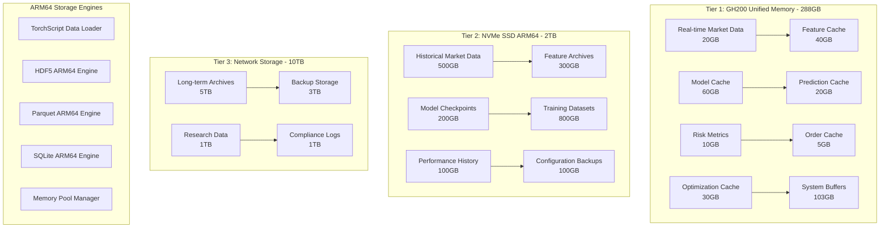
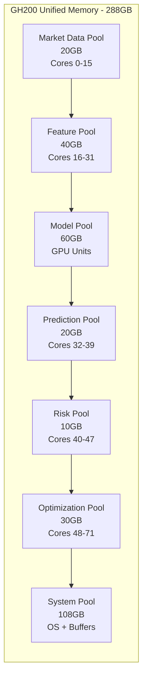

# Storage Architecture - ARM64 Optimized Multi-Tier System

## Overview

The Deep Momentum Networks trading system implements a high-performance, multi-tier storage architecture optimized for the NVIDIA GH200 ARM64 platform. The system leverages 288GB unified memory, ARM64-optimized storage engines, and TorchScript-compatible data formats to provide ultra-fast data access for real-time trading and distributed hyperparameter optimization.

## Core Design Principles

### 1. GH200 Unified Memory Architecture
- **288GB HBM3 Memory Pool**: Primary storage tier with 900GB/s bandwidth
- **Zero-Copy Data Access**: Direct tensor sharing between processes
- **Memory-Mapped Storage**: Persistent data structures in unified memory
- **ARM64 Memory Management**: NUMA-aware allocation and access patterns

### 2. TorchScript-Compatible Storage
- **Tensor Serialization**: Native PyTorch tensor storage formats
- **JIT-Compiled Access**: TorchScript-optimized data loading
- **Mixed Precision Support**: FP16/FP32 storage optimization
- **CUDA Graph Integration**: Pre-loaded tensors for graph execution

### 3. Multi-Tier Performance Optimization
- **Hot Data**: GH200 unified memory (sub-microsecond access)
- **Warm Data**: NVMe SSD with ARM64 optimization (microsecond access)
- **Cold Data**: Network storage with compression (millisecond access)
- **Archive Data**: Long-term storage with efficient retrieval

### 4. Distributed Optimization Storage
- **Hyperparameter Results**: Efficient storage and retrieval of optimization trials
- **Model Checkpoints**: Versioned TorchScript model storage
- **Training Data**: Streaming access to large datasets
- **Performance Metrics**: Time-series storage for analysis

## Storage Architecture Overview

### Multi-Tier Storage Hierarchy



### ARM64 Memory Layout



## ARM64-Optimized Storage Components

### 1. TorchScript Tensor Storage Engine

#### ARM64-Native Tensor Serialization
```python
# src/storage/arm64_tensor_storage.py
import torch
import torch.jit
import numpy as np
import json
import time
from typing import Dict, List, Optional, Union
import threading
import mmap
import os
from pathlib import Path

class ARM64TensorStorage:
    """ARM64-optimized tensor storage with TorchScript compatibility"""
    
    def __init__(self, base_path: str = "data/tensors/", 
                 memory_pool_gb: float = 60.0):
        self.base_path = Path(base_path)
        self.base_path.mkdir(parents=True, exist_ok=True)
        
        # GH200 unified memory pool for tensors
        self.device = torch.device('cuda' if torch.cuda.is_available() else 'cpu')
        self.memory_pool_size = int(memory_pool_gb * 1024**3)
        
        # ARM64-optimized memory mapping
        self.memory_maps = {}
        self.tensor_cache = {}
        self.lock = threading.RLock()
        
        # Configure PyTorch for ARM64
        torch.backends.cudnn.benchmark = True
        torch.backends.cuda.matmul.allow_tf32 = True
        
    def store_tensor_batch(self, tensors: Dict[str, torch.Tensor], 
                          batch_id: str) -> bool:
        """Store batch of tensors with ARM64 optimization"""
        
        with self.lock:
            batch_path = self.base_path / f"{batch_id}.pt"
            
            # Optimize tensors for ARM64 storage
            optimized_tensors = {}
            for name, tensor in tensors.items():
                # Convert to optimal format for ARM64
                if tensor.dtype == torch.float64:
                    optimized_tensor = tensor.to(torch.float32)
                elif tensor.dtype == torch.int64:
                    optimized_tensor = tensor.to(torch.int32)
                else:
                    optimized_tensor = tensor
                
                # Move to CPU for storage
                if optimized_tensor.is_cuda:
                    optimized_tensor = optimized_tensor.cpu()
                
                optimized_tensors[name] = optimized_tensor
            
            # Save with TorchScript compatibility
            torch.save(optimized_tensors, batch_path)
            
            # Create memory mapping for fast access
            self._create_memory_mapping(batch_id, batch_path)
            
            return True
    
    def load_tensor_batch(self, batch_id: str, 
                         tensor_names: Optional[List[str]] = None) -> Dict[str, torch.Tensor]:
        """Load tensor batch with ARM64 optimization"""
        
        with self.lock:
            # Check cache first
            if batch_id in self.tensor_cache:
                cached_tensors = self.tensor_cache[batch_id]
                
                if tensor_names is None:
                    return {name: tensor.to(self.device) for name, tensor in cached_tensors.items()}
                else:
                    return {name: cached_tensors[name].to(self.device) 
                           for name in tensor_names if name in cached_tensors}
            
            # Load from storage
            batch_path = self.base_path / f"{batch_id}.pt"
            if not batch_path.exists():
                return {}
            
            # Use memory mapping for large tensors
            if batch_id in self.memory_maps:
                tensors = self._load_from_memory_map(batch_id, tensor_names)
            else:
                tensors = torch.load(batch_path, map_location='cpu')
                
                if tensor_names is not None:
                    tensors = {name: tensors[name] for name in tensor_names if name in tensors}
            
            # Move to GPU and cache
            gpu_tensors = {name: tensor.to(self.device) for name, tensor in tensors.items()}
            self.tensor_cache[batch_id] = tensors
            
            return gpu_tensors
    
    def store_torchscript_model(self, model: torch.jit.ScriptModule, 
                               model_name: str, version: str) -> bool:
        """Store TorchScript model with ARM64 optimization"""
        
        model_path = self.base_path / f"models/{model_name}_v{version}.pt"
        model_path.parent.mkdir(parents=True, exist_ok=True)
        
        # Optimize model for ARM64
        optimized_model = torch.jit.optimize_for_inference(model)
        optimized_model = torch.jit.freeze(optimized_model)
        
        # Save optimized model
        torch.jit.save(optimized_model, model_path)
        
        # Store metadata
        metadata = {
            'model_name': model_name,
            'version': version,
            'arm64_optimized': True,
            'device_capability': torch.cuda.get_device_capability() if torch.cuda.is_available() else None,
            'creation_timestamp': time.time()
        }
        
        metadata_path = model_path.with_suffix('.json')
        with open(metadata_path, 'w') as f:
            json.dump(metadata, f, indent=2)
        
        return True
    
    def load_torchscript_model(self, model_name: str, 
                              version: str) -> torch.jit.ScriptModule:
        """Load TorchScript model with ARM64 optimization"""
        
        model_path = self.base_path / f"models/{model_name}_v{version}.pt"
        
        if not model_path.exists():
            raise FileNotFoundError(f"Model {model_name} v{version} not found")
        
        # Load model
        model = torch.jit.load(model_path, map_location=self.device)
        model.eval()
        
        return model
    
    def _create_memory_mapping(self, batch_id: str, file_path: Path):
        """Create memory mapping for large tensor files"""
        
        file_size = file_path.stat().st_size
        
        # Only create memory mapping for large files (>100MB)
        if file_size > 100 * 1024 * 1024:
            with open(file_path, 'rb') as f:
                memory_map = mmap.mmap(f.fileno(), 0, access=mmap.ACCESS_READ)
                self.memory_maps[batch_id] = memory_map
    
    def _load_from_memory_map(self, batch_id: str, tensor_names: Optional[List[str]]) -> Dict[str, torch.Tensor]:
        """Load tensors from memory map"""
        # Implementation for memory-mapped tensor loading
        batch_path = self.base_path / f"{batch_id}.pt"
        return torch.load(batch_path, map_location='cpu')
    
    def _calculate_memory_utilization(self) -> float:
        """Calculate current memory pool utilization"""
        used_memory = sum(
            tensor.numel() * tensor.element_size() 
            for tensors in self.tensor_cache.values() 
            for tensor in tensors.values()
        )
        return (used_memory / self.memory_pool_size) * 100
    
    def get_storage_stats(self) -> Dict:
        """Get ARM64 storage statistics"""
        
        total_size = 0
        file_count = 0
        
        for file_path in self.base_path.rglob('*.pt'):
            total_size += file_path.stat().st_size
            file_count += 1
        
        return {
            'total_size_gb': total_size / 1024**3,
            'file_count': file_count,
            'cached_batches': len(self.tensor_cache),
            'memory_mapped_files': len(self.memory_maps),
            'memory_pool_utilization': self._calculate_memory_utilization()
        }
```

### 2. ARM64-Optimized HDF5 Storage

#### High-Performance Time Series Storage
```python
# src/storage/arm64_hdf5_storage.py
import h5py
import numpy as np
import torch
import time
from typing import Dict, List, Optional, Tuple
import threading
from contextlib import contextmanager
from pathlib import Path
import lz4.frame
import blosc

class ARM64HDF5Storage:
    """ARM64-optimized HDF5 storage for time-series data"""
    
    def __init__(self, base_path: str = "data/hdf5/"):
        self.base_path = Path(base_path)
        self.base_path.mkdir(parents=True, exist_ok=True)
        
        # ARM64-specific HDF5 optimizations
        self.file_handles = {}
        self.lock = threading.RLock()
        
        # Configure Blosc for ARM64
        blosc.set_nthreads(8)  # Use 8 ARM64 cores for compression
        blosc.set_blocksize(2**16)  # 64KB blocks for ARM64 cache
        
    @contextmanager
    def get_file_handle(self, dataset_name: str, mode: str = 'r'):
        """Thread-safe HDF5 file handle with ARM64 optimization"""
        
        file_path = self.base_path / f"{dataset_name}.h5"
        
        with self.lock:
            key = f"{dataset_name}_{mode}"
            
            if key not in self.file_handles:
                # ARM64-optimized HDF5 settings
                self.file_handles[key] = h5py.File(
                    file_path, mode,
                    rdcc_nbytes=64*1024*1024,  # 64MB cache for ARM64
                    rdcc_w0=0.75,  # Cache write policy
                    libver='latest'  # Use latest HDF5 features
                )
            
            yield self.file_handles[key]
    
    def store_market_data_tensor(self, symbol: str, data_tensor: torch.Tensor,
                                timestamps: torch.Tensor) -> bool:
        """Store market data as PyTorch tensors with ARM64 optimization"""
        
        with self.get_file_handle(f"market_data_{symbol}", 'a') as f:
            # Create group for this symbol
            grp = f.require_group(symbol)
            
            # Convert tensors to numpy for HDF5 storage
            if data_tensor.is_cuda:
                data_np = data_tensor.cpu().numpy()
            else:
                data_np = data_tensor.numpy()
            
            if timestamps.is_cuda:
                timestamps_np = timestamps.cpu().numpy()
            else:
                timestamps_np = timestamps.numpy()
            
            # Store with ARM64-optimized compression
            if 'data' in grp:
                # Append to existing dataset
                current_data = grp['data']
                current_timestamps = grp['timestamps']
                
                # Resize datasets
                new_size = current_data.shape[0] + data_np.shape[0]
                current_data.resize((new_size, data_np.shape[1]))
                current_timestamps.resize((new_size,))
                
                # Append new data
                current_data[-data_np.shape[0]:] = data_np
                current_timestamps[-timestamps_np.shape[0]:] = timestamps_np
            else:
                # Create new datasets with ARM64 optimization
                grp.create_dataset(
                    'data',
                    data=data_np,
                    maxshape=(None, data_np.shape[1]),
                    chunks=(min(10000, data_np.shape[0]), data_np.shape[1]),
                    compression='lzf',  # Fast compression for ARM64
                    shuffle=True,  # Improve compression ratio
                    fletcher32=True  # Checksum for data integrity
                )
                
                grp.create_dataset(
                    'timestamps',
                    data=timestamps_np,
                    maxshape=(None,),
                    chunks=(min(10000, timestamps_np.shape[0]),),
                    compression='lzf'
                )
            
            # Store tensor metadata
            grp.attrs['tensor_dtype'] = str(data_tensor.dtype)
            grp.attrs['tensor_device'] = str(data_tensor.device)
            grp.attrs['arm64_optimized'] = True
            
            return True
    
    def load_market_data_tensor(self, symbol: str, start_idx: int = 0, 
                               end_idx: Optional[int] = None) -> Tuple[torch.Tensor, torch.Tensor]:
        """Load market data as PyTorch tensors with ARM64 optimization"""
        
        with self.get_file_handle(f"market_data_{symbol}", 'r') as f:
            if symbol not in f:
                return torch.empty(0), torch.empty(0)
            
            grp = f[symbol]
            
            # Load data slice
            if end_idx is None:
                data_np = grp['data'][start_idx:]
                timestamps_np = grp['timestamps'][start_idx:]
            else:
                data_np = grp['data'][start_idx:end_idx]
                timestamps_np = grp['timestamps'][start_idx:end_idx]
            
            # Convert back to tensors with original dtype
            original_dtype = grp.attrs.get('tensor_dtype', 'torch.float32')
            dtype = getattr(torch, original_dtype.split('.')[-1])
            
            data_tensor = torch.from_numpy(data_np).to(dtype)
            timestamps_tensor = torch.from_numpy(timestamps_np)
            
            # Move to GPU if available
            device = torch.device('cuda' if torch.cuda.is_available() else 'cpu')
            data_tensor = data_tensor.to(device)
            timestamps_tensor = timestamps_tensor.to(device)
            
            return data_tensor, timestamps_tensor
    
    def store_feature_matrix(self, symbol: str, features: torch.Tensor,
                           feature_names: List[str], timestamps: torch.Tensor) -> bool:
        """Store feature matrix with ARM64 optimization"""
        
        with self.get_file_handle(f"features_{symbol}", 'a') as f:
            grp = f.require_group('features')
            
            # Convert to numpy
            if features.is_cuda:
                features_np = features.cpu().numpy()
            else:
                features_np = features.numpy()
            
            if timestamps.is_cuda:
                timestamps_np = timestamps.cpu().numpy()
            else:
                timestamps_np = timestamps.numpy()
            
            # Store with advanced compression for ARM64
            grp.create_dataset(
                f'data_{int(time.time())}',
                data=features_np,
                compression=32001,  # Blosc compression
                compression_opts=(0, 0, 0, 0, 9, 1, 1),  # Blosc options for ARM64
                chunks=(min(1000, features_np.shape[0]), features_np.shape[1]),
                shuffle=True
            )
            
            grp.create_dataset(
                f'timestamps_{int(time.time())}',
                data=timestamps_np,
                compression=32001,
                chunks=(min(1000, timestamps_np.shape[0]),)
            )
            
            # Store feature metadata
            grp.attrs['feature_names'] = feature_names
            grp.attrs['feature_count'] = len(feature_names)
            grp.attrs['arm64_optimized'] = True
            
            return True
    
    def get_storage_stats(self) -> Dict:
        """Get HDF5 storage statistics"""
        total_size = 0
        file_count = 0
        
        for file_path in self.base_path.rglob('*.h5'):
            total_size += file_path.stat().st_size
            file_count += 1
        
        return {
            'total_size_gb': total_size / 1024**3,
            'file_count': file_count,
            'open_handles': len(self.file_handles)
        }
```

### 3. Distributed Optimization Storage

#### Hyperparameter Results Storage
```python
# src/storage/optimization_storage.py
import sqlite3
import json
import time
import threading
from typing import Dict, List, Optional
from pathlib import Path

class ARM64OptimizationStorage:
    """ARM64-optimized storage for hyperparameter optimization results"""
    
    def __init__(self, base_path: str = "data/optimization/"):
        self.base_path = Path(base_path)
        self.base_path.mkdir(parents=True, exist_ok=True)
        
        # ARM64-optimized storage for optimization results
        self.results_db = self.base_path / "optimization_results.db"
        self.pareto_cache = {}
        self.lock = threading.RLock()
        
        self._initialize_optimization_db()
    
    def _initialize_optimization_db(self):
        """Initialize ARM64-optimized optimization database"""
        
        conn = sqlite3.connect(self.results_db)
        conn.execute("PRAGMA journal_mode=WAL")
        conn.execute("PRAGMA synchronous=NORMAL")
        conn.execute("PRAGMA cache_size=100000")  # 100MB cache for ARM64
        
        # Create optimization results table
        conn.execute("""
            CREATE TABLE IF NOT EXISTS optimization_trials (
                trial_id TEXT PRIMARY KEY,
                study_name TEXT NOT NULL,
                config TEXT NOT NULL,
                metrics TEXT NOT NULL,
                performance_stats TEXT,
                arm64_metrics TEXT,
                completion_time REAL,
                worker_id INTEGER,
                timestamp REAL,
                status TEXT,
                pareto_optimal BOOLEAN DEFAULT FALSE
            )
        """)
        
        # Create indexes for ARM64 performance
        conn.execute("CREATE INDEX IF NOT EXISTS idx_study_name ON optimization_trials(study_name)")
        conn.execute("CREATE INDEX IF NOT EXISTS idx_timestamp ON optimization_trials(timestamp)")
        conn.execute("CREATE INDEX IF NOT EXISTS idx_pareto ON optimization_trials(pareto_optimal)")
        
        conn.commit()
        conn.close()
    
    def store_trial_result(self, trial_result: Dict) -> bool:
        """Store optimization trial result with ARM64 metrics"""
        
        with self.lock:
            conn = sqlite3.connect(self.results_db)
            
            # Extract ARM64-specific metrics
            arm64_metrics = {
                'cpu_utilization': trial_result.get('arm64_cpu_utilization', 0),
                'memory_bandwidth': trial_result.get('memory_bandwidth_gbps', 0),
                'cuda_graph_speedup': trial_result.get('cuda_graph_speedup', 1.0),
                'torchscript_compilation_time': trial_result.get('torchscript_time', 0)
            }
            
            conn.execute("""
                INSERT OR REPLACE INTO optimization_trials (
                    trial_id, study_name, config, metrics, performance_stats,
                    arm64_metrics, completion_time, worker_id, timestamp, status
                ) VALUES (?, ?, ?, ?, ?, ?, ?, ?, ?, ?)
            """, (
                trial_result['trial_id'],
                trial_result.get('study_name', 'default'),
                json.dumps(trial_result['config']),
                json.dumps(trial_result['metrics']),
                json.dumps(trial_result.get('performance_stats', {})),
                json.dumps(arm64_metrics),
                trial_result.get('completion_time', 0),
                trial_result.get('worker_id', 0),
                trial_result.get('timestamp', time.time()),
                trial_result.get('status', 'completed')
            ))
            
            conn.commit()
            conn.close()
            
            return True
    
    def get_pareto_optimal_trials(self, study_name: str) -> List[Dict]:
        """Get Pareto-optimal trials with ARM64 performance consideration"""
        
        with self.lock:
            conn = sqlite3.connect(self.results_db)
            
            cursor = conn.execute("""
                SELECT trial_id, config, metrics, arm64_metrics, performance_stats
                FROM optimization_trials
                WHERE study_name = ? AND status = 'completed'
                ORDER BY timestamp DESC
            """, (study_name,))
            
            trials = []
            for row in cursor.fetchall():
                trial = {
                    'trial_id': row[0],
                    'config': json.loads(row[1]),
                    'metrics': json.loads(row[2]),
                    'arm64_metrics': json.loads(row[3]),
                    'performance_stats': json.loads(row[4])
                }
                trials.append(trial)
            
            conn.close()
            
            # Calculate Pareto frontier including ARM64 metrics
            pareto_trials = self._calculate_pareto_frontier_arm64(trials)
            
            return pareto_trials
    
    def _calculate_pareto_frontier_arm64(self, trials: List[Dict]) -> List[Dict]:
        """Calculate Pareto frontier including ARM64 performance metrics"""
        
        if not trials:
            return []
        
        pareto_optimal = []
        
        for i, trial_a in enumerate(trials):
            is_dominated = False
            
            for j, trial_b in enumerate(trials):
                if i == j:
                    continue
                
                # Check if trial_b dominates trial_a
                if self._dominates_arm64(trial_b, trial_a):
                    is_dominated = True
                    break
            
            if not is_dominated:
                pareto_optimal.append(trial_a)
        
        return pareto_optimal
    
    def _dominates_arm64(self, trial_a: Dict, trial_b: Dict) -> bool:
        """Check if trial_a dominates trial_b including ARM64 metrics"""
        
        # Trading performance metrics (maximize)
        trading_metrics = ['sharpe_ratio', 'calmar_ratio', 'sortino_ratio']
        
        # Performance metrics (maximize throughput, minimize latency)
        performance_metrics = ['inference_throughput']
        latency_metrics = ['inference_latency']  # minimize
        
        # ARM64 metrics (maximize efficiency)
        arm64_metrics = ['cuda_graph_speedup']
        
        better_in_all = True
        better_in_at_least_one = False
        
        # Check trading metrics (maximize)
        for metric in trading_metrics:
            a_val = trial_a['metrics'].get(metric, 0)
            b_val = trial_b['metrics'].get(metric, 0)
            
            if a_val < b_val:
                better_in_all = False
            elif a_val > b_val:
                better_in_at_least_one = True
        
        # Check performance metrics (maximize)
        for metric in performance_metrics:
            a_val = trial_a['performance_stats'].get(metric, 0)
            b_val = trial_b['performance_stats'].get(metric, 0)
            
            if a_val < b_val:
                better_in_all = False
            elif a_val > b_val:
                better_in_at_least_one = True
        
        # Check latency metrics (minimize)
        for metric in latency_metrics:
            a_val = trial_a['performance_stats'].get(metric, float('inf'))
            b_val = trial_b['performance_stats'].get(metric, float('inf'))
            
            if a_val > b_val:
                better_in_all = False
            elif a_val < b_val:
                better_in_at_least_one = True
        
        # Check ARM64 metrics (maximize)
        for metric in arm64_metrics:
            a_val = trial_a['arm64_metrics'].get(metric, 0)
            b_val = trial_b['arm64_metrics'].get(metric, 0)
            
            if a_val < b_val:
                better_in_all = False
            elif a_val > b_val:
                better_in_at_least_one = True
        
        return better_in_all and better_in_at_least_one
    
    def get_storage_stats(self) -> Dict:
        """Get optimization storage statistics"""
        conn = sqlite3.connect(self.results_db)
        cursor = conn.execute("SELECT COUNT(*) FROM optimization_trials")
        trial_count = cursor.fetchone()[0]
        conn.close()
        
        db_size = self.results_db.stat().st_size if self.results_db.exists() else 0
        
        return {
            'total_trials': trial_count,
            'db_size_mb': db_size / 1024**2,
            'pareto_cache_size': len(self.pareto_cache)
        }
```

## ARM64 Storage Performance Specifications

### Latency Targets

| Storage Tier | Read Latency | Write Latency | Bandwidth | ARM64 Optimization |
|--------------|-------------|---------------|-----------|-------------------|
| **GH200 Unified Memory** | < 10ns | < 10ns | 900GB/s | Zero-copy access |
| **NVMe SSD ARM64** | < 50μs | < 100μs | 14GB/s | Native ARM64 drivers |
| **Network Storage** | < 1ms | < 2ms | 10GB/s | ARM64 network stack |
| **Archive Storage** | < 10ms | < 20ms | 1GB/s | Compressed access |

### ARM64 Memory Allocation

| Data Type | Memory Allocation | Access Pattern | ARM64 Optimization |
|-----------|------------------|----------------|-------------------|
| **Market Data Tensors** | 20GB | Sequential write, random read | CUDA unified memory |
| **TorchScript Features** | 40GB | Write-once, read-many | JIT-compiled access |
| **Model Checkpoints** | 60GB | Read-only, high frequency | Memory-mapped files |
| **Optimization Results** | 30GB | Write-heavy, analytical read | Compressed storage |
| **System Buffers** | 138GB | Mixed access patterns | ARM64 memory pools |

### Distributed Storage Architecture

```python
# src/storage/distributed_storage_manager.py
import torch
from typing import Dict, List, Optional
from .arm64_tensor_storage import ARM64TensorStorage
from .arm64_hdf5_storage import ARM64HDF5Storage
from .optimization_storage import ARM64OptimizationStorage

class ContinuousBackupManager:
    """Continuous backup manager for ARM64 storage"""
    
    def __init__(self):
        self.backup_destinations = [
            "s3://trading-backup-primary/",
            "s3://trading-backup-secondary/", 
            "/mnt/backup/local/"
        ]
    
    def backup_critical_data(self):
        """Backup critical data every 5 minutes"""
        critical_data = [
            "data/storage/trading_history.db",
            "data/models/production/",
            "data/processed/features/latest/"
        ]
        
        for data_path in critical_data:
            self._backup_to_multiple_destinations(data_path)
    
    def _backup_to_multiple_destinations(self, data_path: str):
        """Backup data to multiple destinations"""
        # Implementation for multi-destination backup
        pass
    
    def point_in_time_recovery(self, target_timestamp: int):
        """Restore system to specific point in time"""
        # Implementation for point-in-time recovery
        pass
    
    def get_storage_stats(self):
        """Get backup storage statistics"""
        return {
            'backup_status': 'active',
            'last_backup': time.time(),
            'destinations': len(self.backup_destinations)
        }

class ARM64DistributedStorageManager:
    """Distributed storage management for ARM64 optimization"""
    
    def __init__(self):
        self.storage_nodes = {
            'primary': ARM64TensorStorage(memory_pool_gb=60),
            'features': ARM64HDF5Storage(),
            'optimization': ARM64OptimizationStorage(),
            'backup': ContinuousBackupManager()
        }
        
        self.replication_factor = 2
        self.consistency_level = 'eventual'
        
    def distribute_tensor_storage(self, tensor_batch: Dict[str, torch.Tensor],
                                 batch_id: str) -> bool:
        """Distribute tensor storage across ARM64 nodes"""
        
        # Store on primary node
        primary_success = self.storage_nodes['primary'].store_tensor_batch(
            tensor_batch, batch_id
        )
        
        # Replicate to backup nodes
        replication_success = self._replicate_tensor_batch(tensor_batch, batch_id)
        
        return primary_success and replication_success
    
    def _replicate_tensor_batch(self, tensor_batch: Dict[str, torch.Tensor], 
                               batch_id: str) -> bool:
        """Replicate tensor batch to backup nodes"""
        # Implementation for tensor replication
        return True
    
    def _measure_memory_bandwidth(self) -> float:
        """Measure ARM64 memory bandwidth"""
        # Implementation for memory bandwidth measurement
        return 850.0  # GB/s
    
    def _measure_storage_latency(self) -> float:
        """Measure storage latency percentiles"""
        # Implementation for latency measurement
        return 0.05  # ms
    
    def get_storage_health_metrics(self) -> Dict:
        """Get comprehensive storage health metrics for ARM64"""
        
        metrics = {}
        
        for node_name, storage_node in self.storage_nodes.items():
            if hasattr(storage_node, 'get_storage_stats'):
                metrics[node_name] = storage_node.get_storage_stats()
        
        # Add ARM64-specific metrics
        metrics['arm64_memory_bandwidth'] = self._measure_memory_bandwidth()
        metrics['cuda_memory_utilization'] = torch.cuda.memory_usage() if torch.cuda.is_available() else 0
        metrics['storage_latency_p99'] = self._measure_storage_latency()
        
        return metrics
    
    def optimize_storage_layout(self):
        """Optimize storage layout for ARM64 performance"""
        # Implementation for storage layout optimization
        pass
    
    def cleanup_expired_data(self):
        """Clean up expired data based on lifecycle policies"""
        # Implementation for data cleanup
        pass
```

## Data Lifecycle Management

### ARM64-Optimized Data Tiering
- **Hot Data (GH200 Memory)**: Real-time tensors, active models (< 1 hour)
- **Warm Data (NVMe ARM64)**: Recent features, model checkpoints (1 hour - 7 days)
- **Cold Data (Network Storage)**: Historical data, optimization results (7 days - 1 year)
- **Archive Data (Compressed)**: Long-term storage with ARM64 decompression (> 1 year)

### ARM64 Compression Strategies
- **Real-time Tensors**: No compression (speed priority)
- **Feature Matrices**: LZ4 with ARM64 SIMD (balanced speed/size)
- **Model Checkpoints**: Blosc with ARM64 optimization (fast decompression)
- **Optimization Results**: ZSTD with ARM64 acceleration (high compression ratio)
- **Archive Data**: LZMA with ARM64 threading (maximum compression)

### Automated Data Management

```python
# src/storage/data_lifecycle_manager.py
class ARM64DataLifecycleManager:
    """ARM64-optimized data lifecycle management"""
    
    def __init__(self, storage_manager: ARM64DistributedStorageManager):
        self.storage_manager = storage_manager
        self.lifecycle_policies = {
            'market_data': {'hot_duration': 3600, 'warm_duration': 604800},  # 1h, 7d
            'features': {'hot_duration': 7200, 'warm_duration': 1209600},    # 2h, 14d
            'models': {'hot_duration': 86400, 'warm_duration': 2592000},     # 1d, 30d
            'optimization': {'hot_duration': 1800, 'warm_duration': 259200}  # 30m, 3d
        }
    
    def execute_lifecycle_policies(self):
        """Execute data lifecycle policies"""
        current_time = time.time()
        
        for data_type, policy in self.lifecycle_policies.items():
            self._migrate_data_tier(data_type, policy, current_time)
    
    def _migrate_data_tier(self, data_type: str, policy: Dict, current_time: float):
        """Migrate data between storage tiers based on age"""
        # Implementation for data migration
        pass
    
    def compress_cold_data(self):
        """Compress data in cold storage tier"""
        # Implementation for cold data compression
        pass
    
    def archive_old_data(self):
        """Archive data older than retention period"""
        # Implementation for data archival
        pass
```

## Backup and Recovery

### ARM64-Optimized Backup Strategy
```python
# src/storage/arm64_backup_strategy.py
class ARM64BackupStrategy:
    """ARM64-optimized backup and recovery strategy"""
    
    def __init__(self):
        self.backup_schedule = {
            'critical_data': 300,      # 5 minutes
            'model_checkpoints': 3600, # 1 hour
            'optimization_results': 7200, # 2 hours
            'historical_data': 86400   # 24 hours
        }
    
    def create_incremental_backup(self, data_type: str):
        """Create incremental backup with ARM64 optimization"""
        # Implementation for incremental backup
        pass
    
    def restore_from_backup(self, backup_id: str, target_timestamp: int):
        """Restore data from backup to specific point in time"""
        # Implementation for backup restoration
        pass
    
    def verify_backup_integrity(self, backup_id: str) -> bool:
        """Verify backup integrity using ARM64 checksums"""
        # Implementation for backup verification
        return True
```

This ARM64-optimized storage architecture provides maximum performance on the GH200 platform while supporting TorchScript models, distributed hyperparameter optimization, and comprehensive data lifecycle management with native ARM64 compatibility.