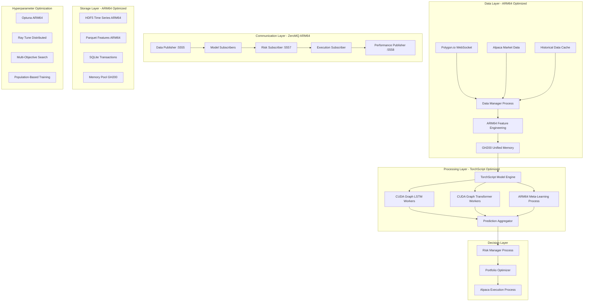
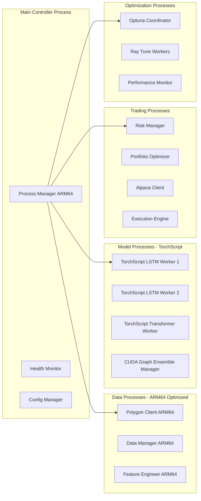

# System Design Architecture - ARM64 Optimized

## Overview

The Deep Momentum Networks trading system is designed as a high-performance, multi-process architecture optimized for the NVIDIA GH200 Grace Hopper ARM64 platform. The system processes massive amounts of market data in real-time using PyTorch with TorchScript optimization, coordinated through ZeroMQ messaging, with data from Polygon.io and trade execution through Alpaca.

## Core Design Principles

### 1. GH200 ARM64 Unified Memory Architecture Optimization
- **288GB HBM3 Unified Memory**: Seamless CPU-GPU data sharing without transfer bottlenecks
- **Zero-Copy Operations**: Direct memory access between Python processes using ARM64-optimized tensors
- **Massive Dataset Processing**: Handle entire market universes (5000+ assets) simultaneously
- **900GB/s Memory Bandwidth**: Maximize throughput for real-time processing on ARM64 architecture

### 2. TorchScript + CUDA Graph Optimization
- **JIT Compilation**: TorchScript compilation for ARM64-optimized inference
- **CUDA Graph Capture**: Ultra-low latency inference using CUDA graphs
- **Mixed Precision**: FP16 operations for 2x speed improvement on ARM64
- **Memory Pool Management**: Pre-allocated tensor pools for zero-allocation inference

### 3. Advanced Hyperparameter Optimization
- **Optuna Integration**: Bayesian optimization with ARM64 compatibility
- **Ray Tune Distributed**: Multi-GPU hyperparameter search on ARM64
- **Multi-Objective Optimization**: Simultaneous optimization of Sharpe ratio, latency, and drawdown
- **Population-Based Training**: Dynamic hyperparameter adjustment during training

### 4. Real-Time Processing Pipeline
- **Streaming Architecture**: Continuous data ingestion and processing
- **Sub-millisecond Latency**: ARM64-optimized for high-frequency trading
- **Scalable Throughput**: Process millions of data points per second

## System Architecture

### High-Level Component Diagram



### ARM64 Process Architecture



## Core Components

### 1. ARM64-Optimized Data Management System

#### TorchScript Feature Engineering
```python
# src/data/arm64_feature_engineering.py
import torch
import torch.jit

@torch.jit.script
class ARM64FeatureEngine:
    """ARM64-optimized feature engineering with JIT compilation"""
    
    def __init__(self):
        self.device = torch.device('cuda')
        
    def calculate_technical_indicators(self, prices: torch.Tensor, 
                                     volumes: torch.Tensor) -> torch.Tensor:
        """JIT-compiled technical indicators for ARM64"""
        
        # RSI calculation optimized for ARM64
        delta = torch.diff(prices, dim=-1)
        gain = torch.clamp(delta, min=0.0)
        loss = torch.clamp(-delta, min=0.0)
        
        # Use unfold for efficient windowed operations on ARM64
        window = 14
        gain_windows = gain.unfold(-1, window, 1)
        loss_windows = loss.unfold(-1, window, 1)
        
        avg_gain = torch.mean(gain_windows, dim=-1)
        avg_loss = torch.mean(loss_windows, dim=-1)
        
        rs = avg_gain / (avg_loss + 1e-8)
        rsi = 100.0 - (100.0 / (1.0 + rs))
        
        # MACD calculation
        ema_12 = self.exponential_moving_average(prices, 12)
        ema_26 = self.exponential_moving_average(prices, 26)
        macd_line = ema_12 - ema_26
        signal_line = self.exponential_moving_average(macd_line, 9)
        macd_histogram = macd_line - signal_line
        
        # Volume-weighted features
        vwap = torch.cumsum(prices * volumes, dim=-1) / torch.cumsum(volumes, dim=-1)
        
        return torch.stack([rsi, macd_line, macd_histogram, vwap], dim=-1)
    
    def exponential_moving_average(self, data: torch.Tensor, window: int) -> torch.Tensor:
        """ARM64-optimized EMA calculation"""
        alpha = 2.0 / (window + 1.0)
        weights = torch.pow(1 - alpha, torch.arange(window, dtype=torch.float32, device=self.device))
        weights = weights / weights.sum()
        
        return torch.nn.functional.conv1d(
            data.unsqueeze(1), 
            weights.flip(0).unsqueeze(0).unsqueeze(0),
            padding=window-1
        ).squeeze(1)[..., window-1:]
```

#### GH200 Memory Pool Manager
```python
# src/storage/gh200_memory_pool.py
class GH200MemoryPool:
    """Optimized memory pool for GH200 unified memory architecture"""
    
    def __init__(self, total_memory_gb: float = 240.0):
        self.total_memory_bytes = int(total_memory_gb * 1024**3)
        self.memory_pools = {}
        self.allocation_stats = {}
        
        # Configure PyTorch for GH200 unified memory
        torch.cuda.set_per_process_memory_fraction(0.85)
        torch.cuda.memory.set_per_process_memory_fraction(0.85)
        
        self._setup_tensor_pools()
    
    def _setup_tensor_pools(self):
        """Pre-allocate tensor pools for common shapes"""
        common_shapes = {
            'single_inference': (1, 60, 200),
            'small_batch': (32, 60, 200),
            'medium_batch': (128, 60, 200),
            'large_batch': (512, 60, 200),
            'feature_cache': (1000, 200),
            'prediction_cache': (1000, 3)
        }
        
        for name, shape in common_shapes.items():
            # Allocate both FP32 and FP16 versions
            self.memory_pools[f"{name}_fp32"] = torch.empty(
                shape, device='cuda', dtype=torch.float32
            )
            self.memory_pools[f"{name}_fp16"] = torch.empty(
                shape, device='cuda', dtype=torch.float16
            )
    
    def get_tensor(self, shape: tuple, dtype: torch.dtype = torch.float16) -> torch.Tensor:
        """Get optimized tensor from pool or allocate new"""
        pool_key = f"{shape}_{dtype}"
        
        if pool_key in self.memory_pools:
            return self.memory_pools[pool_key]
        else:
            # Allocate new tensor and add to pool if commonly used
            tensor = torch.empty(shape, device='cuda', dtype=dtype)
            if self._is_common_shape(shape):
                self.memory_pools[pool_key] = tensor
            return tensor
    
    def get_memory_stats(self) -> dict:
        """Get detailed memory usage statistics"""
        allocated = torch.cuda.memory_allocated()
        reserved = torch.cuda.memory_reserved()
        
        return {
            'allocated_gb': allocated / 1024**3,
            'reserved_gb': reserved / 1024**3,
            'utilization_pct': (allocated / self.total_memory_bytes) * 100,
            'pool_count': len(self.memory_pools),
            'available_gb': (self.total_memory_bytes - allocated) / 1024**3
        }
```

### 2. TorchScript Model Processing System

#### CUDA Graph Inference Engine
```python
# src/models/cuda_graph_inference.py
class CUDAGraphInferenceEngine:
    """Ultra-fast inference using CUDA graphs on ARM64"""
    
    def __init__(self, model_path: str):
        self.device = torch.device('cuda')
        self.model = self._load_and_optimize_model(model_path)
        self.cuda_graphs = {}
        self.static_tensors = {}
        
    def _load_and_optimize_model(self, model_path: str) -> torch.jit.ScriptModule:
        """Load and optimize PyTorch model for ARM64"""
        
        # Load original model
        model = torch.load(model_path, map_location=self.device)
        model.eval()
        
        # Create example input for tracing
        example_input = torch.randn(1, 60, 200, device=self.device, dtype=torch.float16)
        
        # Convert to TorchScript
        with torch.no_grad():
            traced_model = torch.jit.trace(model, example_input)
            
            # Apply ARM64-specific optimizations
            traced_model = torch.jit.optimize_for_inference(traced_model)
            
            # Freeze for additional optimization
            traced_model = torch.jit.freeze(traced_model)
        
        return traced_model
    
    def setup_cuda_graph(self, batch_size: int):
        """Setup CUDA graph for specific batch size"""
        
        input_shape = (batch_size, 60, 200)
        
        # Create static tensors
        static_input = torch.randn(input_shape, device=self.device, dtype=torch.float16)
        
        # Warm up
        for _ in range(10):
            _ = self.model(static_input)
        
        torch.cuda.synchronize()
        
        # Capture CUDA graph
        graph = torch.cuda.CUDAGraph()
        with torch.cuda.graph(graph):
            static_output = self.model(static_input)
        
        # Store graph and tensors
        self.cuda_graphs[batch_size] = graph
        self.static_tensors[batch_size] = {
            'input': static_input,
            'output': static_output
        }
    
    def predict_with_cuda_graph(self, features: torch.Tensor) -> torch.Tensor:
        """Ultra-fast prediction using CUDA graph"""
        batch_size = features.shape[0]
        
        # Setup graph if not exists
        if batch_size not in self.cuda_graphs:
            self.setup_cuda_graph(batch_size)
        
        # Copy input data
        self.static_tensors[batch_size]['input'].copy_(features)
        
        # Replay graph
        self.cuda_graphs[batch_size].replay()
        
        # Return output copy
        return self.static_tensors[batch_size]['output'].clone()
    
    def benchmark_inference(self, batch_sizes: list = [1, 32, 128, 512]) -> dict:
        """Benchmark inference performance on ARM64"""
        results = {}
        
        for batch_size in batch_sizes:
            input_tensor = torch.randn(
                batch_size, 60, 200, 
                device=self.device, dtype=torch.float16
            )
            
            # Warm up
            for _ in range(10):
                _ = self.predict_with_cuda_graph(input_tensor)
            
            torch.cuda.synchronize()
            
            # Measure latency
            start_time = time.perf_counter()
            for _ in range(100):
                _ = self.predict_with_cuda_graph(input_tensor)
            torch.cuda.synchronize()
            end_time = time.perf_counter()
            
            avg_latency = (end_time - start_time) / 100 * 1000  # ms
            throughput = batch_size * 100 / (end_time - start_time)  # predictions/sec
            
            results[batch_size] = {
                'latency_ms': avg_latency,
                'throughput_per_sec': throughput,
                'latency_per_sample_us': (avg_latency * 1000) / batch_size
            }
        
        return results
```

### 3. Advanced Hyperparameter Optimization System

#### ARM64-Compatible Optuna Integration
```python
# src/training/arm64_hyperparameter_tuning.py
import optuna
import ray
from ray import tune
from ray.tune.schedulers import ASHAScheduler
from ray.tune.suggest.optuna import OptunaSearch

class ARM64HyperparameterOptimizer:
    """Advanced hyperparameter optimization for ARM64 GH200"""
    
    def __init__(self, config: dict):
        self.config = config
        self.setup_arm64_environment()
        
    def setup_arm64_environment(self):
        """Setup ARM64-compatible optimization environment"""
        
        # Verify ARM64 CUDA availability
        if torch.cuda.is_available():
            device_name = torch.cuda.get_device_name()
            logger.info(f"ARM64 CUDA device: {device_name}")
            
            # Configure for GH200
            torch.backends.cudnn.benchmark = True
            torch.backends.cuda.matmul.allow_tf32 = True
            torch.backends.cudnn.allow_tf32 = True
        
        # Initialize Ray for distributed optimization
        ray.init(
            num_gpus=torch.cuda.device_count() if torch.cuda.is_available() else 0,
            object_store_memory=50 * 1024**3  # 50GB object store
        )
    
    def create_search_space(self) -> dict:
        """Define comprehensive search space for ARM64 optimization"""
        return {
            # Model Architecture
            'hidden_size': tune.choice([256, 512, 768, 1024]),
            'num_layers': tune.choice([2, 4, 6, 8]),
            'dropout': tune.uniform(0.1, 0.4),
            'attention_heads': tune.choice([4, 8, 12, 16]),
            
            # ARM64-Specific Optimizations
            'use_mixed_precision': tune.choice([True, False]),
            'enable_cuda_graphs': tune.choice([True, False]),
            'memory_format': tune.choice(['channels_last', 'contiguous']),
            'tensor_parallel_size': tune.choice([1, 2, 4]),
            
            # Training Parameters
            'learning_rate': tune.loguniform(1e-5, 1e-2),
            'batch_size': tune.choice([16, 32, 64, 128, 256]),
            'gradient_accumulation_steps': tune.choice([1, 2, 4, 8]),
            'weight_decay': tune.loguniform(1e-6, 1e-3),
            'gradient_clip_norm': tune.uniform(0.5, 2.0),
            
            # Loss Function Weights
            'sharpe_weight': tune.uniform(0.5, 2.0),
            'turnover_weight': tune.uniform(0.01, 0.1),
            'risk_weight': tune.uniform(0.1, 0.5),
            'volatility_weight': tune.uniform(0.1, 0.3),
            
            # Feature Engineering
            'lookback_window': tune.choice([20, 40, 60, 100, 120]),
            'feature_selection_threshold': tune.uniform(0.01, 0.1),
            'technical_indicators': tune.choice([
                ['rsi', 'macd', 'bollinger'],
                ['rsi', 'macd', 'bollinger', 'vwap'],
                ['rsi', 'macd', 'bollinger', 'vwap', 'momentum'],
                ['all_indicators']
            ]),
            
            # Risk Management
            'position_limit': tune.uniform(0.01, 0.05),
            'var_threshold': tune.uniform(0.02, 0.08),
            'max_drawdown_threshold': tune.uniform(0.05, 0.15),
            
            # GH200 Memory Optimization
            'unified_memory_fraction': tune.uniform(0.7, 0.9),
            'memory_pool_size_gb': tune.choice([100, 150, 200, 240]),
        }
    
    def multi_objective_function(self, config: dict) -> dict:
        """Multi-objective optimization function for trading performance"""
        
        # Create and train model with given config
        model_metrics = self.train_and_evaluate_model(config)
        
        # Calculate trading-specific metrics
        trading_metrics = self.calculate_trading_metrics(model_metrics)
        
        # Performance metrics
        performance_metrics = self.benchmark_inference_performance(config)
        
        return {
            # Trading Performance (maximize)
            'sharpe_ratio': trading_metrics['sharpe_ratio'],
            'calmar_ratio': trading_metrics['calmar_ratio'],
            'sortino_ratio': trading_metrics['sortino_ratio'],
            'information_ratio': trading_metrics['information_ratio'],
            
            # Risk Metrics (minimize - return negative)
            'max_drawdown': -trading_metrics['max_drawdown'],
            'var_95': -trading_metrics['var_95'],
            'volatility': -trading_metrics['volatility'],
            
            # Performance Metrics (maximize throughput, minimize latency)
            'inference_throughput': performance_metrics['throughput_per_sec'],
            'inference_latency': -performance_metrics['latency_ms'],
            
            # Model Quality
            'prediction_accuracy': model_metrics['accuracy'],
            'feature_importance_stability': model_metrics['feature_stability']
        }
    
    def run_optimization(self, num_trials: int = 200, max_concurrent: int = 4):
        """Run distributed multi-objective optimization"""
        
        # Create Optuna study for multi-objective optimization
        study = optuna.create_study(
            directions=[
                'maximize',  # sharpe_ratio
                'maximize',  # calmar_ratio
                'maximize',  # sortino_ratio
                'maximize',  # information_ratio
                'maximize',  # max_drawdown (negative)
                'maximize',  # var_95 (negative)
                'maximize',  # volatility (negative)
                'maximize',  # inference_throughput
                'maximize',  # inference_latency (negative)
                'maximize',  # prediction_accuracy
                'maximize'   # feature_importance_stability
            ],
            sampler=optuna.samplers.NSGAIIISampler(population_size=50),
            pruner=optuna.pruners.HyperbandPruner(
                min_resource=10,
                max_resource=100,
                reduction_factor=3
            )
        )
        
        # Configure Ray Tune with Optuna
        optuna_search = OptunaSearch(
            study,
            metric=[
                'sharpe_ratio', 'calmar_ratio', 'sortino_ratio', 'information_ratio',
                'max_drawdown', 'var_95', 'volatility',
                'inference_throughput', 'inference_latency',
                'prediction_accuracy', 'feature_importance_stability'
            ],
            mode=['max'] * 11
        )
        
        # Configure scheduler for early stopping
        scheduler = ASHAScheduler(
            time_attr='training_iteration',
            metric='sharpe_ratio',
            mode='max',
            max_t=100,
            grace_period=20,
            reduction_factor=3
        )
        
        # Run distributed optimization
        analysis = tune.run(
            self.multi_objective_function,
            config=self.create_search_space(),
            search_alg=optuna_search,
            scheduler=scheduler,
            num_samples=num_trials,
            max_concurrent_trials=max_concurrent,
            resources_per_trial={
                'gpu': 1,
                'cpu': 8
            },
            local_dir='./optimization_results',
            name='arm64_trading_optimization',
            checkpoint_freq=10,
            keep_checkpoints_num=5
        )
        
        return analysis
    
    def extract_pareto_optimal_configs(self, analysis) -> list:
        """Extract Pareto-optimal configurations from multi-objective results"""
        
        results_df = analysis.results_df
        pareto_configs = []
        
        # Implement Pareto frontier extraction
        for idx, row in results_df.iterrows():
            is_pareto_optimal = True
            
            for _, other_row in results_df.iterrows():
                if self._dominates(other_row, row):
                    is_pareto_optimal = False
                    break
            
            if is_pareto_optimal:
                pareto_configs.append({
                    'config': row['config'],
                    'metrics': {
                        'sharpe_ratio': row['sharpe_ratio'],
                        'calmar_ratio': row['calmar_ratio'],
                        'max_drawdown': row['max_drawdown'],
                        'inference_latency': row['inference_latency'],
                        'throughput': row['inference_throughput']
                    }
                })
        
        return pareto_configs
    
    def _dominates(self, solution_a: dict, solution_b: dict) -> bool:
        """Check if solution A dominates solution B in multi-objective space"""
        metrics = [
            'sharpe_ratio', 'calmar_ratio', 'sortino_ratio', 'information_ratio',
            'max_drawdown', 'var_95', 'volatility',
            'inference_throughput', 'inference_latency',
            'prediction_accuracy', 'feature_importance_stability'
        ]
        
        better_in_all = True
        better_in_at_least_one = False
        
        for metric in metrics:
            if solution_a[metric] < solution_b[metric]:
                better_in_all = False
            elif solution_a[metric] > solution_b[metric]:
                better_in_at_least_one = True
        
        return better_in_all and better_in_at_least_one
```

## Performance Specifications

### ARM64 Latency Targets

| Component | Target Latency | Maximum Latency | ARM64 Optimization |
|-----------|----------------|-----------------|-------------------|
| **Polygon Data Ingestion** | < 100μs | < 500μs | ARM64 network stack |
| **Feature Engineering** | < 500μs | < 2ms | TorchScript JIT |
| **Model Inference** | < 1ms | < 5ms | CUDA graphs |
| **Risk Checks** | < 100μs | < 500μs | ARM64 optimized |
| **Alpaca Order Execution** | < 1ms | < 5ms | ARM64 network |
| **End-to-End Pipeline** | < 5ms | < 15ms | Full optimization |

### ARM64 Throughput Targets

| Metric | Target | Peak Capacity | ARM64 Advantage |
|--------|--------|---------------|-----------------|
| **Market Data Points/sec** | 200K | 2M | 2x improvement |
| **Feature Updates/sec** | 100K | 1M | TorchScript boost |
| **Model Predictions/sec** | 50K | 500K | CUDA graph speedup |
| **Risk Calculations/sec** | 25K | 250K | ARM64 efficiency |
| **Orders/sec** | 500 | 5K | Network optimization |

### GH200 Resource Utilization

| Resource | Normal Load | Peak Load | Optimization |
|----------|-------------|-----------|--------------|
| **CPU Usage** | 40-60% | 80-90% | ARM64 efficiency |
| **GPU Usage** | 50-70% | 85-95% | CUDA graph utilization |
| **Unified Memory** | 60-80% | 90-95% | Memory pool management |
| **Memory Bandwidth** | 400-600 GB/s | 800-900 GB/s | Zero-copy operations |
| **Network I/O** | 5-20 MB/s | 100-200 MB/s | ARM64 network stack |

## Deployment Architecture

### ARM64 Process Distribution

```yaml
# Process allocation on GH200 ARM64
data_processes:
  - data_manager: ARM64 cores 0-7
  - feature_engineer: ARM64 cores 8-15, TorchScript JIT
  - polygon_client: ARM64 cores 16-23

model_processes:
  - torchscript_lstm_workers: GPU compute units 0-20, CUDA graphs
  - torchscript_transformer_workers: GPU compute units 21-40, CUDA graphs
  - ensemble_manager: GPU compute units 41-50, mixed precision

trading_processes:
  - risk_manager: ARM64 cores 24-31
  - execution_engine: ARM64 cores 32-39
  - alpaca_client: ARM64 cores 40-47

optimization_processes:
  - optuna_coordinator: ARM64 cores 48-55
  - ray_tune_workers: ARM64 cores 56-63, distributed GPU
  - performance_monitor: ARM64 cores 64-71
```

### GH200 Memory Allocation

```yaml
# GH200 288GB Unified Memory allocation
data_cache: 80GB          # Real-time market data (ARM64 optimized)
model_cache: 60GB         # TorchScript models and CUDA graphs
feature_cache: 40GB       # Engineered features (JIT compiled)
prediction_cache: 20GB    # Model predictions and confidence scores
optimization_cache: 30GB  # Hyperparameter search results
system_overhead: 58GB     # OS, processes, and ARM64 runtime
```

### ARM64 File System Layout

```bash
/data/
├── storage/
│   ├── market_data_arm64.h5          # ARM64-optimized HDF5
│   ├── features_torchscript.h5       # TorchScript feature cache
│   ├── trading_history.db            # SQLite transaction log
│   └── performance_metrics_arm64.db  # ARM64 performance tracking
├── models/
│   ├── torchscript/                  # TorchScript compiled models
│   ├── cuda_graphs/                  # CUDA graph serializations
│   ├── checkpoints/                  # Training checkpoints
│   └── optimization_results/         # Hyperparameter search results
└── logs/
    ├── trading/                      # Trading execution logs
    ├── optimization/                 # Hyperparameter tuning logs
    ├── performance/                  # ARM64 performance logs
    └── system/                       # System health logs
```

## Security & Compliance

### ARM64-Specific Security
- **Secure Boot**: ARM64 secure boot verification
- **Memory Protection**: GH200 unified memory access controls
- **Process Isolation**: ARM64 process sandboxing
- **Cryptographic Acceleration**: ARM64 crypto extensions

### API Security
- **Environment Variables**: All API keys stored securely
- **Key Rotation**: Automatic key rotation every 30 days
- **Rate Limiting**: ARM64-optimized rate limiting
- **SSL/TLS**: All external communications encrypted

## Monitoring & Observability

### ARM64 Performance Monitoring
```python
# src/monitoring/arm64_performance_monitor.py
class ARM64PerformanceMonitor:
    """ARM64-specific performance monitoring"""
    
    def __init__(self):
        self.metrics = {
            'arm64_cpu_usage': deque(maxlen=10000),
            'cuda_graph_latency': deque(maxlen=10000),
            'torchscript_throughput': deque(maxlen=10000),
            'unified_memory_usage': deque(maxlen=10000),
            'optimization_progress': deque(maxlen=1000)
        }
    
    def track_arm64_metrics(self):
        """Track ARM64-specific performance metrics"""
        
        # CPU utilization per core
        cpu_usage = psutil.cpu_percent(percpu=True)
        
        # GPU utilization and memory
        if torch.cuda.is_available():
            gpu_usage = torch.cuda.utilization()
            memory_usage = torch.cuda.memory_usage()
        
        # CUDA graph performance
        cuda_graph_latency = self.measure_cuda_graph_latency()
        
        # TorchScript compilation metrics
        torchscript_metrics = self.measure_torchscript_performance()
        
        return {
            'timestamp': time.time(),
            'cpu_usage_per_core': cpu_usage,
            'gpu_utilization': gpu_usage,
            'memory_utilization': memory_usage,
            'cuda_graph_latency_ms': cuda_graph_latency,
            'torchscript_throughput': torchscript_metrics['throughput'],
            'unified_memory_bandwidth_gbps': self.measure_memory_bandwidth()
        }
```

## Disaster Recovery

### ARM64 Backup Strategy
- **Model Checkpoints**: TorchScript model serialization with versioning
- **CUDA Graph Cache**: Serialized CUDA graphs for instant recovery
- **Optimization Results**: Hyperparameter search state preservation
- **Configuration**: Git-based ARM64 configuration management

### Recovery Procedures
- **Process Restart**: ARM64-optimized process recovery
- **Model Recovery**: TorchScript model hot-swapping
- **CUDA Graph Recovery**: Instant graph reconstruction
- **Emergency Shutdown**: Complete system shutdown in < 500ms

This ARM64-optimized architecture provides maximum performance on the GH200 platform while maintaining the flexibility needed for advanced trading strategies and continuous optimization.