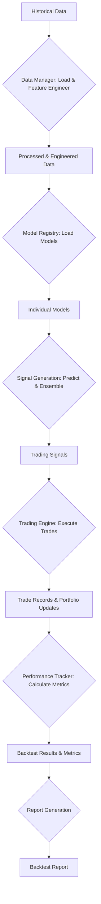

# Deep Momentum Trading System: Backtesting Strategy Overview

This document provides a comprehensive overview of the backtesting strategy employed within the Deep Momentum Trading System, detailing its purpose, core components, data flow, and performance evaluation methods.

## 1. Purpose of Backtesting

Backtesting is a crucial process used to evaluate the performance and robustness of trading models and strategies using historical market data. It allows us to:
*   Assess the profitability and risk characteristics of a strategy before deploying it in live markets.
*   Identify potential flaws, biases, or overfitting in the models.
*   Optimize strategy parameters and compare different models or ensemble approaches.
*   Gain confidence in the strategy's potential performance under various market conditions.

## 2. Core Backtesting Engine

The central component for backtesting is the `BacktestEngine` (defined in [`deep_momentum_trading/scripts/backtest.py`](deep_momentum_trading/scripts/backtest.py)). This engine orchestrates the entire backtesting process, from data loading and signal generation to trade execution simulation and performance analysis.

### Key Aspects of the Backtesting Engine:

*   **Configurability**: The backtesting process is highly configurable through `BacktestConfig` parameters, allowing users to define:
    *   **Time Period**: `start_date` and `end_date` for the backtest.
    *   **Capital & Risk**: `initial_capital`, `max_positions`, `position_size`.
    *   **Models & Strategies**: Specific models to use (`models`), and the `ensemble_method` if multiple models are involved.
    *   **Execution Costs**: `commission`, `slippage`, and `market_impact` to simulate real-world trading costs.
    *   **Performance Benchmarks**: `benchmark` (e.g., SPY) and `risk_free_rate` for calculating risk-adjusted returns.
    *   **Processing**: `parallel_processing` and `chunk_size` for optimizing performance.
    *   **Output**: `output_dir` for results, and flags to `save_trades` and `generate_report`.
*   **ARM64 Optimizations**: The `ARM64BacktestOptimizer` is integrated to leverage ARM64-specific optimizations, including calculating optimal worker counts for parallel processing and optimizing batch sizes for data processing, enhancing the efficiency of backtest execution.
*   **Modular Integration**: The `BacktestEngine` integrates seamlessly with other core components of the system:
    *   `ModelRegistry`: For loading and managing trained models.
    *   `DataManager`: For accessing and preparing historical market data.
    *   `TradingEngine`: For simulating trade execution.
    *   `RiskManager`: For potential future integration of advanced risk management during backtesting.
    *   `PerformanceTracker`: For calculating and tracking performance metrics.

## 3. Backtesting Data Flow and Process

The backtesting process follows a structured pipeline to ensure accurate and reliable simulations:

### Detailed Steps:

1.  **Data Loading and Preparation**:
    *   Historical market data for the specified `start_date` and `end_date` is loaded using the `DataManager`.
    *   This raw data undergoes the same preprocessing and feature engineering steps as the training data, ensuring consistency between training and backtesting environments. This includes validation, missing data handling, outlier removal, resampling, and the generation of various technical indicators.

2.  **Model Loading**:
    *   The `BacktestEngine` loads the specified trained models from the `ModelRegistry`. This can include individual models (e.g., `DeepMomentumLSTM`, `TransformerMomentumNetwork`) or an `EnsembleMomentumSystem`.

3.  **Signal Generation**:
    *   For each time step in the historical data, the loaded models generate trading predictions or signals based on the engineered features.
    *   If multiple models are used, their individual signals are combined using a specified `ensemble_method` (e.g., simple averaging, adaptive meta-learning) to produce a final trading signal.

4.  **Trade Execution Simulation**:
    *   Based on the generated trading signals, the `TradingEngine` simulates trade execution.
    *   This involves determining position sizes, executing buy/sell orders, and accounting for realistic trading costs such as `commission` and `slippage`.
    *   The portfolio value and current positions are updated at each step.

5.  **Performance Metric Calculation**:
    *   After simulating trades across the entire backtest period, the `PerformanceTracker` calculates a comprehensive set of financial performance metrics. These metrics are crucial for evaluating the strategy's effectiveness.
    *   **Key Metrics Calculated**:
        *   `total_return`: Overall return over the backtest period.
        *   `annual_return`: Annualized return.
        *   `volatility`: Standard deviation of returns, indicating risk.
        *   `sharpe_ratio`: Risk-adjusted return, measuring excess return per unit of risk.
        *   `max_drawdown`: The largest peak-to-trough decline in portfolio value.
        *   `win_rate`: Percentage of profitable trades.
        *   `total_trades`: Total number of trades executed.
        *   `final_portfolio_value`: The portfolio value at the end of the backtest.
    *   These metrics align with the `metrics` defined in the `validation` section of [`deep_momentum_trading/config/training_config.yaml`](deep_momentum_trading/config/training_config.yaml).

6.  **Report Generation**:
    *   A detailed backtest report is generated, including:
        *   CSV files for all simulated trades and portfolio values over time.
        *   A summary report (text file) containing all calculated performance metrics and the backtest configuration.
    *   This report provides a clear and concise overview of the backtest results.

## 4. Validation Techniques

To ensure the robustness and generalizability of the models, the backtesting strategy incorporates advanced validation techniques:

*   **Walk-Forward Validation**:
    *   Enabled and configured in [`deep_momentum_trading/config/training_config.yaml`](deep_momentum_trading/config/training_config.yaml) under the `validation.walk_forward` section.
    *   This technique simulates a rolling, real-world deployment scenario. The historical data is divided into sequential training and testing periods.
    *   **`window_size_days`**: Defines the length of the training window (e.g., 252 days for 1 year of trading days).
    *   **`step_size_days`**: Defines how far the training window slides forward for the next iteration (e.g., 63 days for 1 quarter).
    *   **`min_train_size_days`**: Ensures a minimum amount of data is available for initial training.
    *   This approach helps to identify how a model would perform as it continuously learns and adapts to new market data over time, mitigating look-ahead bias.

*   **Cross-Validation**:
    *   While standard cross-validation (`enabled: false` in `training_config.yaml`) is not the primary method due to the time-series nature of financial data, the configuration allows for `time_series_split: true` if cross-validation were to be enabled, ensuring that data leakage from future periods is avoided.

## Conclusion

The backtesting strategy of the Deep Momentum Trading System is designed to provide a rigorous and realistic evaluation of trading models. By simulating real-world conditions, accounting for trading costs, employing advanced validation techniques like walk-forward analysis, and generating comprehensive performance reports, the system aims to build and validate robust, high-performing trading strategies.