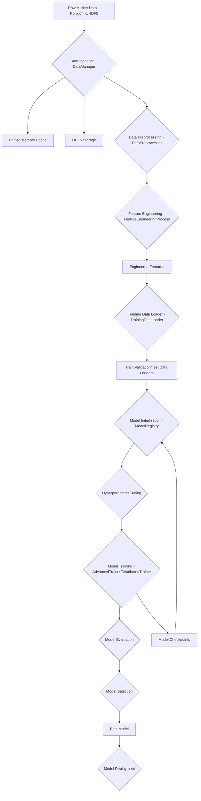

# Deep Momentum Trading System: Model Training Overview

This document provides a comprehensive overview of the model training strategy, data utilization, and the various models employed within the Deep Momentum Trading System.

## 1. Model Training Strategy and Process

The core of our model training is orchestrated by the `AdvancedTrainingPipeline` (defined in [`deep_momentum_trading/src/training/training_pipeline.py`](deep_momentum_trading/src/training/training_pipeline.py)). This pipeline is designed for high-performance, robustness, and adaptability, incorporating ARM64 optimizations, distributed training capabilities, and automated hyperparameter tuning.

### Key Aspects of the Training Strategy:

*   **Configurable and Modular Design**: The entire training process is highly configurable via YAML files (e.g., [`deep_momentum_trading/config/training_config.yaml`](deep_momentum_trading/config/training_config.yaml)), allowing for flexible experimentation and deployment.
*   **ARM64 Optimizations**: Leveraging the NVIDIA GH200 Grace Hopper platform, the system incorporates ARM64-specific optimizations at various stages, including data processing, feature engineering, and model execution, to maximize computational efficiency.
*   **Distributed Training**: The pipeline supports distributed training using `DistributedTrainer` (defined in [`deep_momentum_trading/src/training/distributed_trainer.py`](deep_momentum_trading/src/training/distributed_trainer.py)) for scaling training across multiple GPUs or nodes, as configured in `training_config.yaml`.
*   **Automated Hyperparameter Tuning**: The `AdvancedHyperparameterTuner` (defined in [`deep_momentum_trading/src/training/hyperparameter_tuning.py`](deep_momentum_trading/src/training/hyperparameter_tuning.py)) automates the search for optimal model hyperparameters, improving model performance and reducing manual effort.
*   **Financial Metric-Driven Optimization**: Models are trained using custom loss functions, such as `CombinedLoss` (defined in [`deep_momentum_trading/src/models/loss_functions.py`](deep_momentum_trading/src/models/loss_functions.py)), which directly optimize for financial performance metrics like Sharpe Ratio, Turnover, and Risk, rather than just traditional machine learning metrics.
*   **Comprehensive Model Management**: The `ModelRegistry` (defined in [`deep_momentum_trading/src/models/model_registry.py`](deep_momentum_trading/src/models/model_registry.py)) handles the registration, versioning, saving, loading, and performance tracking of all models.

### Training Pipeline Steps:

The `AdvancedTrainingPipeline` executes the following sequence of operations:

1.  **Setup and Validation**: Initializes the workspace, creates necessary directories, and validates the training configuration.
2.  **Data Preparation**: Loads and prepares data using `TrainingDataLoader`. This involves fetching historical data and setting up real-time data streams.
3.  **Model Initialization**: Instantiates models based on configurations in the `ModelRegistry`, applying ARM64 optimizations where applicable.
4.  **Hyperparameter Optimization**: (Optional, if enabled) Runs automated hyperparameter tuning for specified models.
5.  **Model Training**: Trains models using `AdvancedTrainer` or `DistributedTrainer`, monitoring progress and saving checkpoints.
6.  **Model Evaluation**: Evaluates trained models on a test dataset using financial performance metrics.
7.  **Model Selection**: Selects the best-performing model based on predefined criteria (e.g., highest Sharpe Ratio) using `AdvancedModelSelector` (defined in [`deep_momentum_trading/src/training/model_selection.py`](deep_momentum_trading/src/training/model_selection.py)).
8.  **Model Deployment**: (Optional, if enabled) Deploys the selected best model to production or staging environments.
9.  **Results Generation**: Compiles and saves comprehensive pipeline results, including training history, metrics, and deployment status.

### Training Pipeline Data Flow

## 2. Data Usage

The system utilizes a sophisticated data pipeline to ensure high-quality, timely, and relevant data for model training and inference.

### Data Sources:

*   **Real-time Market Data**: Primarily sourced from Polygon.io via `AdvancedPolygonClient` (defined in [`deep_momentum_trading/src/data/polygon_client.py`](deep_momentum_trading/src/data/polygon_client.py)). This provides live trade, quote, and aggregate minute data.
*   **Historical Data**: Stored in HDF5 format (`deep_momentum_trading/data/raw/polygon/market_data.h5`) for backtesting and training on past market conditions.

### Data Flow and Processing:

1.  **Data Ingestion (`DataManager` - [`deep_momentum_trading/src/data/data_manager.py`](deep_momentum_trading/src/data/data_manager.py))**:
    *   Ingests real-time data from Polygon.io.
    *   Applies ARM64-optimized data processing for efficient handling.
    *   Caches hot data in a `UnifiedMemoryManager` (defined in [`deep_momentum_trading/src/data/memory_cache.py`](deep_momentum_trading/src/data/memory_cache.py)) for quick access.
    *   Persists data to HDF5 storage for historical records.
    *   Publishes processed data via ZeroMQ for other system components, including feature engineering.

2.  **Data Preprocessing (`DataPreprocessor` - [`deep_momentum_trading/src/data/data_preprocessing.py`](deep_momentum_trading/src/data/data_preprocessing.py))**:
    *   **Validation**: Checks for missing columns, validates timestamp formats, and ensures numeric data types.
    *   **Missing Data Handling**: Fills missing values using methods like forward-fill (`ffill`), backward-fill (`bfill`), mean, median, or dropping rows, as configured.
    *   **Outlier Removal**: Identifies and handles outliers using statistical methods (e.g., Z-score based on standard deviations).
    *   **Resampling**: Aggregates data to desired time intervals (e.g., 1-minute bars) for OHLCV (Open, High, Low, Close, Volume) data.
    *   **Normalization**: (Optional, typically applied during feature engineering) Scales data using methods like Min-Max, Standard (Z-score), or Robust scaling.
    *   All preprocessing steps are optimized for ARM64 and can leverage parallel processing for large datasets.

3.  **Feature Engineering (`FeatureEngineeringProcess` - [`deep_momentum_trading/src/data/feature_engineering.py`](deep_momentum_trading/src/data/feature_engineering.py))**:
    *   Transforms preprocessed market data into a rich set of technical indicators and features.
    *   Utilizes Numba JIT compilation with `fastmath` for highly optimized, ARM64-friendly calculations of indicators.
    *   **Types of Features Generated**:
        *   **Momentum Indicators**: Relative Strength Index (RSI), Moving Average Convergence Divergence (MACD), Momentum.
        *   **Volatility Indicators**: Standard Deviation, Bollinger Bands (BB).
        *   **Advanced Indicators**: Stochastic Oscillator, Average True Range (ATR), Williams %R.
        *   **Volume Indicators**: Volume Moving Averages, On-Balance Volume (OBV), Volume Rate of Change.
        *   **Price-based Features**: Daily Returns, Log Returns, High-Low Range, Open-Close Range, Gaps.
        *   **Moving Averages**: Simple Moving Averages (SMA), Exponential Moving Averages (EMA) for various windows.
    *   Features are cached in unified memory and published via ZeroMQ for consumption by model processes.

4.  **Training Data Loading (`TrainingDataLoader` - [`deep_momentum_trading/src/training/training_data_loader.py`](deep_momentum_trading/src/training/training_data_loader.py))**:
    *   Creates PyTorch `Dataset` and `DataLoader` instances from the processed and engineered data.
    *   Supports both historical data loading (split into training, validation, and test sets) and real-time streaming data for continuous learning.

## 3. Models Employed

The system employs a variety of deep learning models, managed and instantiated through the `ModelRegistry` (defined in [`deep_momentum_trading/src/models/model_registry.py`](deep_momentum_trading/src/models/model_registry.py)) and `ModelFactory`.

### Model Architectures:

The `ModelFactory` registers and creates instances of the following model types:

*   **`DeepMomentumLSTM`** (defined in [`deep_momentum_trading/src/models/deep_momentum_lstm.py`](deep_momentum_trading/src/models/deep_momentum_lstm.py)): A Long Short-Term Memory (LSTM) network designed to capture temporal dependencies and momentum patterns in financial time series data. Configurable parameters include input size, hidden size, number of layers, and dropout.
*   **`TransformerMomentumNetwork`** (defined in [`deep_momentum_trading/src/models/transformer_momentum.py`](deep_momentum_trading/src/models/transformer_momentum.py)): A Transformer-based model, leveraging self-attention mechanisms to process sequences and identify long-range dependencies in market data, potentially offering superior performance for complex patterns. Configurable parameters include input size, `d_model`, number of attention heads, and number of layers.
*   **`EnsembleMomentumSystem`** (defined in [`deep_momentum_trading/src/models/ensemble_system.py`](deep_momentum_trading/src/models/ensemble_system.py)): An ensemble system that combines predictions from multiple base models (e.g., LSTM and Transformer models) to improve robustness and predictive accuracy. It supports various ensemble methods like weighted averaging.
*   **`MetaLearningOptimizer`** and **`OnlineMetaLearner`** (defined in [`deep_momentum_trading/src/models/meta_learner.py`](deep_momentum_trading/src/models/meta_learner.py)): These represent advanced meta-learning capabilities, allowing the system to learn how to learn, or adapt quickly to new market conditions and tasks. This enables more agile and adaptive trading strategies.

### Loss Functions:

The system utilizes specialized loss functions to align model training directly with trading objectives:

*   **`CombinedLoss`**: A primary loss function that combines multiple financial objectives, such as Sharpe Ratio optimization, turnover regularization, and risk adjustment.
*   **`SharpeOptimizedLoss`**: Directly optimizes for the Sharpe Ratio, a key measure of risk-adjusted return.
*   **`TurnoverRegularization`**: Penalizes excessive trading activity to reduce transaction costs.
*   **`RiskAdjustedLoss`**: Incorporates risk measures into the loss calculation.
*   Other specialized loss functions like `InformationRatioLoss`, `CalmarRatioLoss`, and `SortinoRatioLoss` are also available.

### Model Configuration:

Model configurations, including their types, parameters, and specific training parameters (e.g., epochs, batch size), are defined in `deep_momentum_trading/config/model_config.yaml` and are loaded by the `ModelRegistry`.

## Conclusion

The Deep Momentum Trading System employs a sophisticated, high-performance, and adaptive approach to model training. By integrating real-time data ingestion, advanced preprocessing and feature engineering, and a diverse set of deep learning models optimized for financial outcomes, the system aims to develop robust and profitable trading strategies. The emphasis on ARM64 optimizations and distributed computing ensures that the system can handle large volumes of data and complex models efficiently.